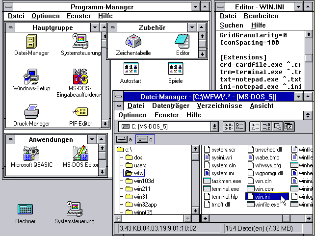
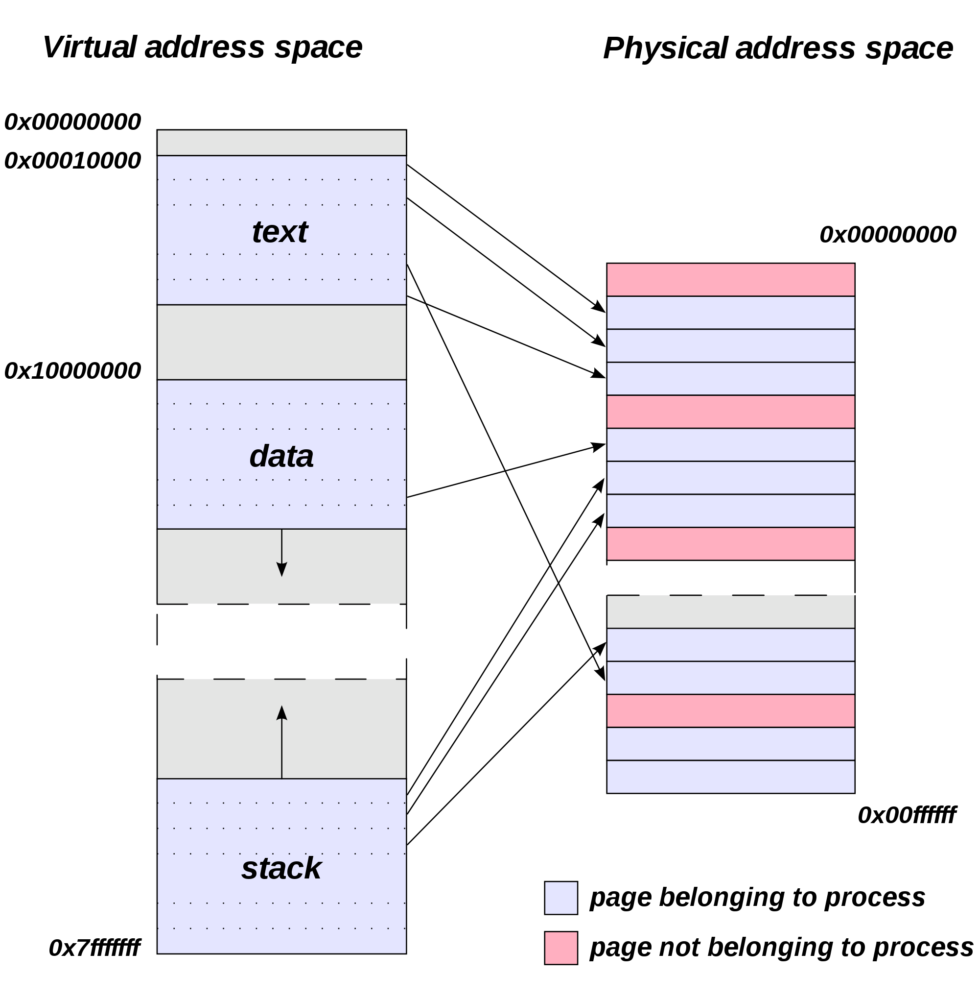
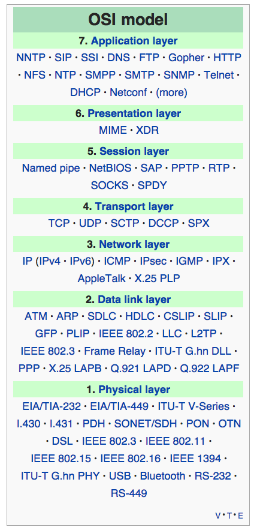
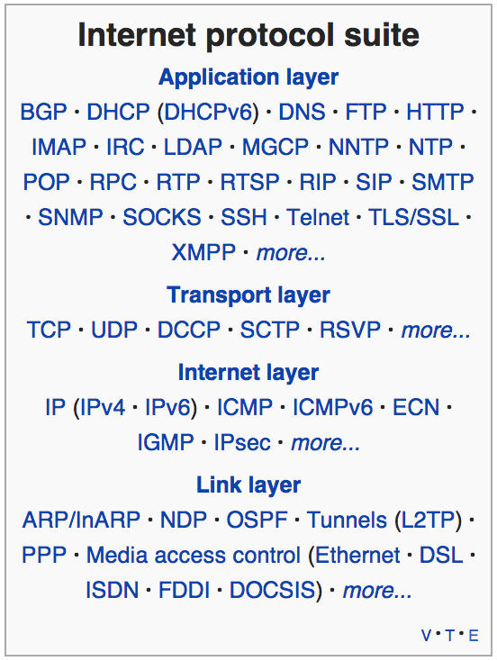
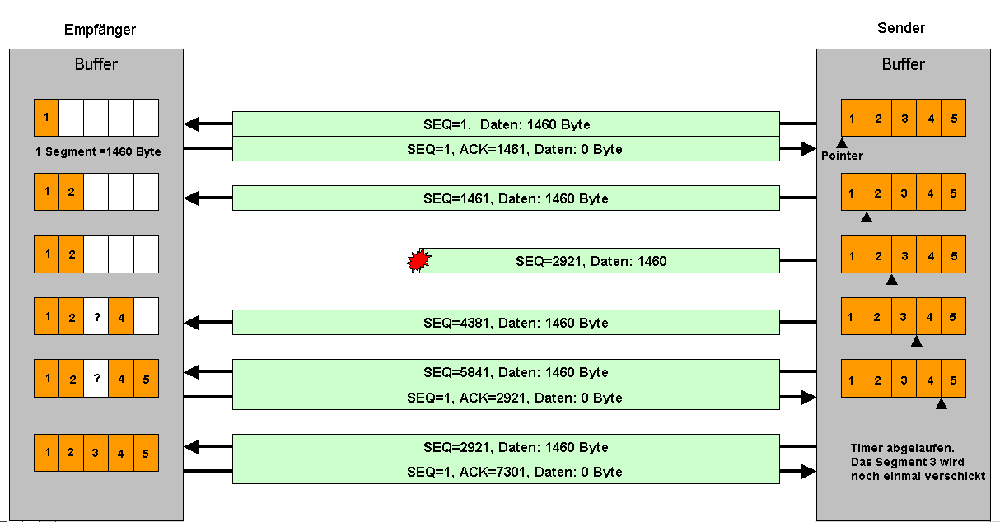

# Betriebssysteme und Netze

Tim Weber für den Kurs MMK13 der DHBW Mannheim, März bis Juni 2014.

Ein kleiner Hinweis: Personenbezeichnungen in diesem Skriptum verwenden zur Verbesserung der Lesbarkeit ausschließlich die weibliche Form. Die männliche ist selbstverständlich mit gemeint.

###### Aufbau und Ablauf
* 9 Termine à 180 Minuten
* Teil 1: Betriebssysteme
* Teil 2: Netze
* Anwesenheitsliste
* Fragen jederzeit
* lernen Sie _während_ des Semesters
* Rückfragen auch gern in der Facebook-Gruppe oder per Mail
***

### Zeitliche Planung

Dieses Semester haben wir 9 Termine, jeweils montags von 10:30 Uhr bis 13:30 Uhr, also je 3 Stunden.

Da wie jedes Mal die Klausurzeit von 55 Minuten von der Vorlesungszeit von 1.620 Minuten (36× 45 Minuten) abgezogen wird, bleiben uns ganze 55 Minuten Pause, die wir auf diese neun Termine verteilen können, also 6 Minuten und 6 Sekunden pro Termin.

Ich bin über diese kurze Pausenzeit nicht besonders glücklich, weil wir damit quasi jeden Montagmorgen 3 Stunden durchmachen müssen, aber mein Einwand diesbezüglich wurde ignoriert.

Die Vorlesung besteht aus 16 Abschnitten, sieben für den Teil »Betriebssysteme« und neun für den Teil »Netze«. Pro Termin werde ich versuchen, zwei Abschnitte zu bearbeiten, so dass uns der letzte Termin für Wiederholung und Klausurvorbereitung bleibt.

### Anwesenheit

Auch diesmal gibt es wieder eine Anwesenheitsliste, die ich jeden Montag durchgehen werde. Verspätungen und Fehlzeiten werden eingetragen. Wenn Sie krank oder vorhersehbar abwesend sind, sagen Sie bitte sowohl dem Sekretariat als auch mir Bescheid, [E-Mail](mailto:dhbw@timweber.name) genügt.

### Fragen

Fragen können Sie während der Vorlesung jederzeit stellen. Trauen Sie sich: Es ist sehr unwahrscheinlich, dass Ihnen etwas unklar ist, aber Ihre Kommilitoninnen es restlos und perfekt verstanden haben.

Erinnern Sie sich noch an meinen Hinweis in der Rechnerstrukturen-Vorlesung, dass Sie am Besten _während_ des Semesters lernen und die Vorlesung nachbereiten sollen? Viele von Ihnen werden diesen Hinweis ignoriert haben und in der Klausurphase gemerkt haben, dass ich ja irgendwie doch ein bisschen recht hatte. Also seien Sie dieses Semester etwas klüger! ;)

Wenn Sie beim Nachbereiten Fragen haben, stellen Sie sie mir entweder am Anfang der Vorlesung der nächsten Woche, oder schreiben Sie sie in die Facebook-Gruppe. Ich schaue da von Zeit zu Zeit rein und beantworte die Fragen, außer eine Kommilitonin kommt mir zuvor.

Falls unbedingt nötig, können Sie mir auch per Mail eine Frage stellen, aber die Wahrscheinlichkeit, dass wirklich niemand außer Ihnen mit der Antwort was anfangen kann, ist äußerst gering.

### Folien, Materialien, Mitschriebe

###### ~
* Folien sind inzwischen aus dem Browser druckbar, aber immer noch keine Auswendiglern-Vorlage
* schreiben Sie mit, stellen Sie Fragen
* **verstehen** Sie die Inhalte
* PDF-Exporte stelle ich keine zur Verfügung, unterstütze Sie aber gern bei Designanpassungen
***

Ich habe das selbstgebastelte Präsentationssystem vom letzten Semester noch mal umgeworfen und neu geschrieben. Diesmal mit besonderem Augenmerk auf Ihre anscheinend wichtigsten Bedürfnisse:

1. Papier vernichten
2. viel lesen

Die Druckansicht habe ich deshalb als allererstes implementiert, und dieses Semester entsteht auch gleichzeitig ein Prosatext, begleitend zu den Folien. Das Design ist noch nicht optimal, aber auf die inneren Werte kommt es an!

Die Folien eignen sich wohlgemerkt immer noch nicht zum Auswendiglernen, und das Skriptum ist etwas zu umfangreich. Von daher empfehle ich Ihnen, die Inhalte der Vorlesung zu _verstehen_. Schreiben Sie mit, stellen Sie Fragen, arbeiten Sie das Material zu Hause auf, lesen Sie in den verlinkten Wikipedia-Artikeln herum. Inzwischen wissen Sie, wie meine Klausuren aussehen, und dass sie absolut machbar sind – wenn man sich nicht nur auf auswendig gelernte Folien beschränkt.

Letztes Semester haben Sie selbst ein PDF aus den Folien erstellt, indem Sie Screenshots angefertigt haben. Diesmal geht das etwas einfacher, Sie können die Folien direkt aus dem Browser drucken. Benutzen Sie den großen Button »Präsentationsmodus aktivieren« ganz am Anfang des Skriptums, wenn Sie die Folien sehen (und drucken) wollen, oder drucken Sie einfach das Skriptum. Die Folien sind im Skriptum am rechten Rand eingebaut und exakt die selben wie in der Folienansicht.

Ich werde Ihnen kein PDF erstellen (sondern stelle eine Website zur Verfügung) und auch nicht Ihrer Dropbox beitreten (weil mir da zu viel los ist). Wenn das von mir verwendete Druck-Stylesheet noch verbesserungswürdig ist, sagen Sie mir bitte Bescheid, ich passe das dann entsprechend an.

### Aufbau »Betriebssysteme«

###### ~
* Aufgaben und Bestandteile eines OS
* Beispiele für verschiedene Betriebssysteme
* Multitasking, Scheduling
* Speichermanagement
* Datenspeicherung und Dateien
* lokale Dateisysteme
* Netzwerk-Dateisysteme
***

Im Betriebssysteme-Teil beschäftigen wir uns erst mal mit der Frage, was ein Betriebssystem (engl. _operating system_, OS) überhaupt ist, aus was es besteht und wofür es da ist. Danach sehen wir uns verschiedene Betriebssysteme an, damit Sie ein Gefühl dafür bekommen, wo ihre Gemeinsamkeiten und Unterschiede liegen.

Danach sehen wir uns ein Feature an, das Sie für selbstverständlich halten dürften, weil alle Betriebssysteme, die Sie benutzen, dieses Feature haben: _Multitasking_, also die Fähigkeit, mehrere Dinge „gleichzeitig“ zu tun. Verwandt damit ist das Thema _Scheduling_, bei dem es darum geht, in welcher Reihenfolge und mit welcher Priorität diese gleichzeitig ausgeführten Aufgaben bearbeitet werden.

Beim _Speichermanagement_ geht es darum, wie der Arbeitsspeicher unter den laufenden Programmen aufgeteilt wird und wie das OS dafür sorgt, dass Programme nicht auf den Speicher anderer Programme zugreifen können – und warum das überhaupt wichtig ist.

Außerdem sehen wir uns im Detail an, was eigentlich eine _Datei_ ist, wie der Computer Dateien intern speichert und verwaltet und welche Probleme er dabei eigentlich lösen muss. Und da Dateien sowohl _lokal_ (direkt auf Ihrem Rechner) als auch _remote_ (auf einem Server oder in der Cloud) gespeichert werden können, werfen wir einen Blick darauf, was die Eigenheiten der verschiedenen Speicherungsarten sind. Dabei lernen wir mehrere _Dateisysteme_ kennen, denn je nach Einsatzzweck und Betriebssystem läuft die interne Speicherung unterschiedlich ab.

### Aufbau »Netze«

###### ~
* OSI-Referenzmodell, Protokoll-Überblick
* IP-Protokollfamilie (TCP, UDP, ICMP)
* IP-Bereiche und -Vergabe (DHCP etc.)
* IPv6
* Router, Gateways, MTU
* Anwendungsprotokolle (HTTP, SMTP, DNS)
* verschlüsselte Kommunikation (SSL, TLS)
* VPNs
* Terminaldienste (SSH, Remote Desktop)
***

Der Teil »Netze« beschäftigt sich mit Computernetzen im Allgemeinen und dem Internet im Besonderen. Das OSI-Referenzmodell, das wir letztes Semester nur kurz angerissen haben, schauen wir uns jetzt genauer an, und ich geben Ihnen einen Überblick darüber, welche _Protokolle_ (Kommunikationsstandards) es im Internet eigentlich gibt. Von den hunderten, vielleicht tausenden Protokollen greifen wir uns dann ein paar raus, um sie genauer zu betrachten.

Dafür müssen wir aber erst einmal wissen, welche Arten von Protokollen es gibt: fast alle kann man in die drei Klassen TCP, UDP und ICMP einteilen. Außerdem braucht man zur Kommunikation _IP-Adressen_. Wie die aussehen, in welche Bereiche man sie einteilt und wie man eine bekommt, ist ebenso Thema wie der langsam auch bei den Endanwendern ankommende neue Standard _IPv6_.

Bevor wir uns dann endlich mit Anwendungsprotokollen wie HTTP und SMTP beschäftigen können, brauchen wir Basiswissen dazu, wie die Datenpakete im Internet eigentlich den Weg von einem Rechner zum anderen finden: nämlich über Router und Gateways, und auch die Abkürzungen _MTU_ und _DNS_ spielen dabei eine Rolle.

Und wenn Sie Wert darauf legen, dass nicht jede Zwischenstation die Möglichkeit hat, Ihre Kommunikationsinhalte mitzulesen, sollten Sie Ihre Daten verschlüsseln. Die entsprechenden Standards _SSL_ und _TLS_ schauen wir uns ebenso an wie die _virtuellen privaten Netzwerke_ (VPNs), mit denen Sie vertrauenswürdige Kommunikation über ein nicht vertrauenswürdiges Netz wie das Internet abwickeln können.

Ganz zum Schluss werfen wir dann noch einen Blick auf sogenannte Terminaldienste, also Dienste, mit denen Sie sich auf einem anderen Computer anmelden können und ihn so benutzen, als säßen Sie direkt davor.

# Teil 1: Betriebssysteme

## Aufgaben und Bestandteile eines Betriebssystems

###### Was macht ein Betriebssystem?
* viele Programme laufen „gleichzeitig“, aber der Computer hat oft nur einen Prozessor
* viele unterschiedliche Hersteller und Arten von Festplatten, aber sie sollen für Anwendungssoftware einheitlich ansprechbar sein
* Ein-/Ausgabe, Netzwerkdienste, Audio, Dateisystem, Geolokalisierung, …
***

In diesem Abschnitt geht es hauptsächlich darum, einen Überblick über die vielfältigen Aufgaben eines Betriebssystems zu gewinnen. Machen Sie sich keine Sorgen, wenn Sie einige der angesprochenen Begriffe nicht kennen: Sie werden sie noch früh genug verstehen müssen. ;)

###### Multitasking/Scheduling
* ein Rechner hat meist 1–16 Prozessoren/Cores, aber führt hunderte Prozesse gleichzeitig aus
* Software teilt sich die Prozessoren
* OS legt fest, wer wann und wie lange darf, abhängig von Priorität und Ereignissen
* bei mehreren Cores auch, was optimalerweise gleichzeitig läuft
***

### ~

Beispiel _Multitasking_: Darunter versteht man die Fähigkeit eines Computers, mehrere Dinge scheinbar gleichzeitig auszuführen: Dateien kopieren, Musik abspielen und ein Textdokument drucken. Aber wie kann ein Rechner so etwas tun, wenn er beispielsweise nur einen einzigen Prozessor hat? Selbst wenn der Prozessor mehrere _Cores_ besitzt, kann jeder Core nur eine Aufgabe gleichzeitig ausführen. Und da ein Computer weit mehr Aufgaben zu bearbeiten hat als das, was Sie als Anwendungen sehen (z.B. Netzwerkkommunikation, Virenschutz, Wartungs-Aufgaben, Verarbeitung von Benutzereingaben etc.), laufen auf einem durchschnittlichen System eine zwei- bis dreistellige Anzahl an _Prozessen_ gleichzeitig.

Die Magie dahinter ist das Betriebssystem, das die Ressource ›Rechenzeit‹ verwaltet. Es legt fest, welcher Core wann und wie lange welche Aufgabe ausführt. Jede Aufgabe wird meist nur einen Bruchteil einer Sekunde ausgeführt, danach wird sie kurzzeitig aufs Eis gelegt und ein anderer Prozess wird fortgesetzt. Dieser Wechsel zwischen Prozessen kann durchaus mehrere hundert Mal pro Sekunde durchgeführt werden; so schnell, dass es für die Benutzerin so wirkt, als würden alle diese Aufgaben gleichzeitig bearbeitet.

Außerdem ist nicht jeder Prozess gleich wichtig: Das Betriebssystem entscheidet anhand der Wichtigkeit und anderen Faktoren (z.B. ob für den Prozess neue Daten vorliegen), wie lange der Prozess laufen darf. Es kann sogar entscheiden, welche Prozesse bei einer Maschine mit mehreren Cores am besten gleichzeitig laufen sollten.

###### virtueller Speicher
* Programme sollen isoliert voneinander laufen, sich nicht beeinflussen
* dürfen nicht auf den Arbeitsspeicher anderer Programme zugreifen
* Betriebssystem überwacht dies
* gerade nicht benötigte Speicherbereiche werden auf Festplatte ausgelagert; erhöht Anzahl gleichzeitig lauffähiger Prozesse
***

### ~

Die Verwaltung des virtuellen Speichers ist eine weitere Aufgabe des Betriebssystems. Ohne Betriebssystem könnte prinzipiell jeder Prozess, jedes Programm auf den Arbeitsspeicher (RAM) eines anderen Programms zugreifen und Daten daraus lesen oder darin verändern. Das dubiose Freeware-Spiel, das Sie heruntergeladen haben, könnte die Onlinebanking-PIN auslesen, die Sie gerade in Ihrem Browser eingeben. Das Betriebssystem schützt Sie davor, indem es den Zugriff auf den Speicher verwaltet. Prozesse können nicht direkt auf den RAM zugreifen, sondern nur auf die Bereiche, die ihnen das Betriebssystem zugewiesen hat.

Außerdem sorgt es dafür, dass Sie den Programmen auf Ihrem Computer mehr RAM zur Verfügung stellen können, als überhaupt physisch in Ihrem Computer verbaut sind. Diesen Trick erledigt das Betriebssystem dadurch, dass Speicherbereiche, in denen ein Prozess zwar Daten abgelegt hat, aber momentan nicht damit arbeitet, vom Betriebssystem klammheimlich stattdessen auf die Festplatte geschrieben werden. Der entsprechende RAM-Bereich kann dann einem anderen Prozess zugewiesen werden, der ihn gerade nötiger braucht. Will der ursprüngliche „Besitzer“ dann seine Daten wiederhaben, lädt das Betriebssystem die Daten wieder von der Festplatte und tut so, als wäre nichts gewesen.

###### Hardwareabstraktion
* z.B.: Soundkarten unterschiedlicher Hersteller werden unterschiedlich angesteuert
* darum sollen sich die Programme aber nicht kümmern müssen
* OS stellt einheitliche Schnittstelle bereit
* ähnlich für Festplatten, Grafikkarten, Tastaturen, Mäuse, Drucker, …
***

### ~

Mit einer S-Klasse, einem Golf und einem Punto kann man im Prinzip das gleiche machen: von A nach B fahren. In Details unterscheiden sie sich allerdings: die Anzahl Gänge, wo der Scheibenwischerhebel sitzt und auch die Höchstgeschwindigkeit variiert.

Bei Computerkomponenten ist das nicht anders: drei verschiedene Soundkarten haben z.B. unterschiedliche Ein- und Ausgänge, außerdem wird die eine an PCIe, die andere an USB angeschlossen, und welche Kommandos man an sie schicken muss, um Töne zu generieren, unterscheidet sich auch zwischen Herstellern und Modellen. Wenn jetzt jede Anwendung, die Musik abspielen will, alle diese Eigenheiten der Soundkarten kennen müsste, hätten die Programmiererinnen dieser Anwendungen wahnsinnig viel zu tun. Und als Anwenderin stünde man vor dem Problem, dass Spotify vielleicht Musik spielen könnte, aber Skype die Soundkarte nicht kennt und daher keinen Ton aufzeichnet.

Auch hier hilft das Betriebssystem: Mit Hilfe sogenannter _Treiber_ vermittelt es zwischen den Anwendungen und der Hardware. Als Anwendung muss man nur noch eine einzige Programmierschnittstelle beherrschen, nämlich die zum Betriebssystem, und das Betriebssystem kommuniziert dann mit der Soundkarte.

###### Netzwerk- und andere Verbindungen
* Treiber für verschiedene Netzwerkkarten
* Unterstützung für Standards und Protokolle (Ethernet, IP, …)
* Firewall, Routing, Traffic-Shaping, …
* Software für automatische Konfiguration (z.B. DHCP), Management und Sharing von Netzwerkverbindungen
* Bluetooth, WLAN, ISDN, Packet Radio, …
***

### ~

Abgesehen davon, dass das Betriebssystem natürlich auch bei Netzwerkkarten entsprechend dolmetscht, sind auch die Protokolle, die im Internet so „gesprochen“ werden, alles andere als einfach. Im Laufe der Vorlesung werden wir uns beispielsweise TCP genauer ansehen, und Sie werden feststellen: Wenn jede Anwendung TCP selbst implementieren müsste, wäre das ein enormer Aufwand.

Deshalb stellt auch hier das Betriebssystem wieder standardisierte und vereinfachte Schnittstellen zur Verfügung. Eine Anwendung kann einfach sagen, dass sie eine Verbindung zu diesem-und-jenem Rechner aufbauen möchte, und das Betriebssystem kümmert sich um die ganzen Details hinter den Kulissen. Außerdem hat es Treiber für eine Vielzahl von Hard- und Softwarestandards. Damit muss sich eine Anwendung auch nicht mehr darum kümmern, _wie_ sie ins Internet kommt. Ob per WLAN, Ethernet, Bluetooth oder gar Packet Radio, die Schnittstelle zur Netzwerkkommunikation ist identisch – dank des Betriebssystems.

###### Was ist eigentlich ein Treiber?
* ein Stück Software
* speziell für ein Gerät, eine Geräteserie oder einen Standard geschrieben
* angepasst für das jeweilige Betriebssystem (bzw. die Betriebssystemversion), auf dem er läuft
* spricht auf der einen Seite mit dem Betriebssystem und ist über standardisierte OS-Schnittstelle ansprechbar, auf der anderen Seite mit dem Gerät etc.
***

### Treiber

Jetzt habe ich schon zweimal das Wort ›Treiber‹ erwähnt, das Sie sicher auch schon andernorts gehört haben, aber noch nicht erklärt, um was es sich handelt.

Allgemein gesagt ist ein Treiber ein Programm, das als Vermittler dient. Zwischen wem oder was? Nun, auf der einen Seite kommuniziert er mit dem Betriebssystem und ist quasi dessen „Handlanger“: Er ist derjenige, der die eigentliche Übersetzungsarbeit leistet. Auf der anderen Seite spricht er mit einem Peripheriegerät oder implementiert ein Protokoll, eine Schnittstelle oder Ähnliches.

Beispielsweise gibt es einen Treiber für USB-Massenspeicher und einen für SATA-Massenspeicher. Beide bieten dem Betriebssystem die selbe Schnittstelle an: So kann es sich an den Treiber wenden mit einer Anfrage wie »Bitte gib mir von Gerät X den Speicherblock 1234«, und der Treiber kümmert sich darum, diese Anfrage entsprechend zu bearbeiten.

Die Kommandos, die ein SATA-Gerät für diese Anfrage erwartet, sind anders als die, die ein USB-Gerät dafür erwartet, und überhaupt sind USB und SATA zwei völlig unterschiedliche Schnittstellen mit ganz charakteristischen Eigenschaften. Aber das kann dem Betriebssystem an dieser Stelle egal sein, denn der Treiber kümmert sich darum und liefert ihm die entsprechenden Daten zurück.

Es kann übrigens durchaus sein, dass der Treiber dann seinerseits wieder einen anderen Treiber beauftragt! So gibt es Treiber für USB-Massenspeicher, USB-Soundkarten und USB-Eingabegeräte, und alle drei müssen zumindest die Grundlagen der Kommunikation mit USB-Geräten beherrschen, um ihre Aufgaben erledigen zu können. Diese Grundlagen werden aber nicht von jedem dieser drei Treiber neu implementiert, sondern beispielsweise ausgelagert in einen allgemeinen USB-Treiber. Der weiß zwar nicht, was der Unterschied zwischen einer USB-Tastatur und einem USB-Kopfhörer ist, aber dafür können die „höheren“ USB-Treiber an ihn die ganze grundlegende Kommunikation (z.B. Adressierung der Geräte oder das Reagieren auf das Ein- und Ausstecken von Geräten) delegieren und müssen sich ihrerseits nicht darum kümmern.

Am Ende dieser ganzen „Wertschöpfungskette“, wenn man so will, steht dann die Anwendung. Für sie wird all das getan.

1. Die Anwendung will ein Katzenfoto von der Festplatte öffnen, also wendet sie sich an das Betriebssystem und sagt »gib mir Datei X«.
2. Das Betriebssystem gibt diese Anfrage an den Dateisystemtreiber, z.B. den für NTFS, weiter.
3. Der NTFS-Treiber weiß, dass die Datei auf Festplatte 3 liegt und bittet das Betriebssystem um Block 1234 von Festplatte 3.
4. Das Betriebssystem weiß, dass Festplatte 3 per USB angebunden ist und bittet den USB-Massenspeicher-Treiber, Block 1234 von Festplatte 3 zu holen.
5. Der USB-Massenspeicher-Treiber teilt dem allgemeinen USB-Treiber den Befehl mit, den dieser, an das entsprechende Gerät senden soll.
6. Sobald die Festplatte antwortet, fließen die Daten in umgekehrter Reihenfolge zurück durch die Instanzen und kommen schlussendlich bei der Anwendung an.

###### Wie viel Software gehört zum Betriebssystem?
* aus Anwenderinnensicht: ganzes Programmpaket (Taschenrechner, Browser, Bildbetrachter, …)
* aus Informatikerinnensicht: _Kernel_
* Betriebssystemkern ohne Zubehörprogramme, evtl. inkl. Treibermodulen
* denn: Kernel läuft privilegiert, Anwendungsprogramme nicht
* selbst Netzwerkconfig (DHCP) ist demnach nicht Teil des Betriebssystems
***

### Abgrenzung zwischen Betriebssystem und Anwendungen

Es ist nicht ganz einfach zu definieren, wo das Betriebssystem aufhört und Anwendungssoftware anfängt, insbesondere weil es Anwendungssoftware gibt, die sehr eng mit dem Betriebssystem zusammen arbeitet.

Aus Sicht der Endanwenderinnen enthält ein „Betriebssystem“ wie z.B. Windows 7 beispielsweise den Internet Explorer, einen Bildbetrachter, einen Taschenrechner etc. – aber aus Sicht einer Informatikerin gehört keiner der genannten Teile zum eigentlichen Betriebssystemkern, dem sogenannten _Kernel_. Je nachdem, wen man fragt, gehören auch die einzelnen Treiber nicht zum Betriebssystem.

Die wichtigste Unterscheidung zwischen OS und Anwendungen ist die Frage, mit welchen Rechten sie laufen. Das Betriebssystem hat die vollständige Kontrolle über den Computer und alle angeschlossene Hardware, kann z.B. auf beliebigen Speicher zugreifen und jede Anwendung beenden. Anwendungsprogramme dagegen können, selbst wenn sie mit Administratorrechten ausgeführt werden, alle diese Tätigkeiten nur über Anfragen an das Betriebssystem durchführen.

Deswegen gilt für uns in dieser Vorlesung: Software, die mit diesen privilegierten Rechten ausgeführt wird, gilt als Teil des Betriebssystems, und zwar unabhängig davon, ob sie ursprünglich mitgeliefert wurde. So wird beispielsweise der Treiber für eine Webcam, nachdem ich ihn von der beiliegenden CD installiert habe, ab dem Zeitpunkt der Installation auch Bestandteil des Betriebssystems. Der Internet Explorer, das Programm zur Festplattendefragmentierung oder auch das Programm zur WLAN-Konfiguration gehören hingegen nicht dazu. (Letzteres kommuniziert die von der Anwenderin getroffenen Entscheidungen auch nur über eine entsprechende Schnittstelle an das Betriebssystem.)

###### Neuartige OS-Features
* Geolocation (wo befindet sich der Rechner?)
* Cloud-Dienste (iCloud, GCM)
* Virtualisierung (ein Rechner im Rechner)
***

### ~

Inzwischen stellen Betriebssysteme einige neuartige Funktionen bereit, bei denen man sich streiten kann, inwiefern sie wirklich Teil des Betriebssystems sind, insbesondere weil sie teilweise die angesprochenen zusätzlichen Privilegien nicht besitzen. Andererseits handelt es sich um eine zentrale Schnittstelle, die vom entsprechenden Betriebssystem den Anwendungen angeboten werden.

So kann auf meinem Mac, aber auch auf meinem Android-Gerät, jede Anwendung das „Betriebssystem“ nach der aktuellen Position des Rechners auf der Erde fragen. Das „Betriebssystem“ kümmert sich dann darum, mit einer geeigneten Technik (GPS, WLAN-Datenbanken, Glonass) eine möglichst genaue Antwort zu liefern. Die entsprechende Software läuft nicht privilegiert, aber die Schnittstellen werden eben von jedem aktuellen OS X bzw. Android (etc.) angeboten (und nicht etwa durch eine nachzuinstallierende Drittsoftware), weshalb man durchaus davon reden kann, dass dieses Feature Teil des Betriebssystems ist.

Ähnlich verhält es sich mit Cloud-Diensten, die es ermöglichen, Dateien zwischen Geräten zu synchronisieren oder auf standardisierte Weise Benachrichtigungen („Push-Nachrichten“) an ein Mobiltelefon zu schicken.

Auch Virtualisierungsdienste werden inzwischen teilweise vom Betriebssystem angeboten. So kann ich auf einem Linux-Rechner einen zweiten, „virtuellen“ Linux-Rechner installieren, ihn virtuell starten und herunterfahren und mit ihm interagieren wie mit einem normalen Rechner – allerdings läuft er nicht direkt auf echter Hardware, sondern das „äußere“ Linux (das sog. _Host-System_) gaukelt ihm einen echten Rechner vor. Damit diese Virtualisierung möglichst performant läuft, bringen Betriebssysteme Zusatzmodule mit. Diese laufen wohlgemerkt privilegiert.

## Beispiele für verschiedene Betriebssysteme

###### ~
* Windows
* OS X
* Linux
* Android
* iOS
* Windows Phone
* Chrome OS
***

In diesem Kapitel werfen wir einen Blick auf einige der momentan am weitesten verbreiteten Betriebssysteme und beleuchten Ihre Geschichte und Eigenheiten.

Übrigens gilt, wie auch schon letztes Semester: Jahreszahlen sind auf keinen Fall klausurrelevant. Und ignorieren Sie die auf den Folien aufgeführten ›Dateisysteme‹ für den Moment, wir werden später im entsprechenden Kapitel noch darauf zurückkommen.

###### Microsoft Windows: Geschichte
* ursprünglich Aufsatz auf MS-DOS

***

### Microsoft Windows

Windows ist wahrscheinlich das bekannteste Betriebssystem überhaupt, wahrscheinlich jede von Ihnen hat schon einmal damit gearbeitet. Bei den meisten Computern ist es vorinstalliert dabei, und viele Menschen glauben, dass es einfach zu Computern dazu gehört und wissen gar nicht, dass es auch andere Betriebssysteme gibt.

Bevor es Windows gab, verkaufte Microsoft ein Betriebssystem mit textbasierter Oberfläche: _MS-DOS_ (Microsoft Disk Operating System). Und die ersten Windows-Versionen waren auch einfach nur grafische Benutzeroberflächen für DOS. Das heißt, der Computer startete DOS, und Windows war einfach nur ein Anwendungsprogramm, im Prinzip wie jede andere auch. Allerdings hatte Windows einige Features, die durchaus Betriebssystem-Charakter hatten: So führte es beispielsweise Multitasking ein, das in purem DOS noch nicht verfügbar war. Außerdem gab es für Windows Gerätetreiber, beispielsweise für eine Vielzahl von Druckern.

###### Microsoft Windows: Geschichte
* der DOS-Aufsatz wurde weiterentwickelt bis einschl. Windows 95/98
* parallel dazu die Windows-NT-Linie mit unabhängigem Kernel; DOS war darin nur noch emuliert (2000, XP, Vista, 7, 8)
***

Dieses Prinzip mit DOS als darunterliegendem Betriebssystem und Windows als grafischem Aufsatz mit Betriebssystemcharakter wurde beibehalten bis zu den Windows-Versionen 95 bzw. 98. Ab Windows 95 verbarg Microsoft das Vorhandensein von DOS zunehmend, beispielsweise startete Windows beim Hochfahren des Computers automatisch (früher musste man es manuell von DOS aus starten), und auch der eigentliche textbasierte DOS-Bootvorgang wurde hinter einer grafischen Boot-Animation versteckt. Dabei ging es Microsoft hauptsächlich darum, den Computer weniger „technisch“ wirken zu lassen – und textbasierte Benutzerschnittstellen fühlen sich nun mal so an.

Gleichzeitig begann man Anfang der 1990er Jahre aber auch, Windows-Versionen zu entwickeln, die direkt auf der Hardware liefen und DOS nicht mehr benötigten. Dabei handelt es sich um die sogenannte _Windows-NT-Linie_, während man bei den DOS-basierten Versionen von der _DOS-Linie_ spricht. Das ›NT‹ steht dabei für ›new technology‹.

NT war insbesondere konzeptioniert als mehrbenutzerfähiges Netzwerk-Betriebssystem. (Zwei Dinge die heute selbstverständlich sind: fast jedes Betriebssystem kann mit mehreren Benutzern, oft gleichzeitig, arbeiten, und hat Funktionen, um in ein Netzwerk eingebunden zu werden.) Es gab einige Versionen von Windows NT, angefangen mit NT 3.1, dessen Versionsnummer sich an das damals aktuelle, DOS-basierte Windows 3.1 anlehnte.

Nach NT 4.0 fand man bei Microsoft, dass die neue Betriebssystemlinie reif genug für den Endanwenderinnen-Einsatz war und der DOS-Zweig langsam sterben sollte. Allerdings hatte NT den Ruf, ein Serverbetriebssystem zu sein, weshalb man sich entschloss, an das damals aktuelle Namensschema der DOS-Linie anzuknüpfen und die NT-Version 5.0 unter dem Namen ›Windows 2000‹ zu vermarkten. Damit verkaufte man es quasi als Nachfolger der letzten DOS-Linien-Version, Windows 98.

Aber auch Windows 2000 behielt den Ruf, ein Server-Betriebssystem zu sein, und so warf man das komplette Namensschema über den Haufen und nannte den Nachfolger _Windows XP_ (für ›experience‹) und verpasste ihm eine buntere, weniger businessmäßig wirkende Oberfläche. Nach XP kam Vista, nach Vista kamen Windows 7 und 8. Gleichzeitig gibt es auch weiterhin NT-Varianten für den Serverbetrieb, die unter dem Namen ›Windows Server‹ mit Jahreszahlen verkauft werden, aktuell z.B. _Windows Server 2012_.

###### Microsoft Windows: Eigenheiten
* universelles Endanwenderinnensystem
* sehr verbreitet weil sehr entwicklerinnenfreundlich (Abwärtskompatibilität)
* wg. dieser Verbreitung beliebtes Angriffsziel
* Sicherheit lange Zeit vernachlässigt
* inzwischen recht gute Sicherheitsmechanismen
* Dateisysteme: NTFS, FAT, ISO 9660, UDF, SMB/CIFS, WebDAV
***

Windows ist für den universellen Einsatz konzipiert: Es soll sowohl Büroanwendungen als auch Spiele als auch Serverdienste als auch Spezialfälle wie z.B. Fahrkarten- oder Geldautomaten abdecken, und in der Tat wird es in allen diesen Bereichen eingesetzt. Aber vor allem in Büros und Privathaushalten hat es eine unangefochtene Marktdominanz erreicht.

Diese Marktdominanz entstand insbesondere dadurch, weil das Entwickeln von Software für Windows lukrativ ist: Microsoft legt viel Wert darauf, dass für Windows geschriebene Software ohne Anpassungen auch Jahre später noch auf der beispielsweise über-übernächsten Version von Windows lauffähig ist. Das bedeutet für Entwicklerinnen weniger Wartungsarbeit und die Möglichkeit, mit einer einmal geschriebenen Software ohne weitere Entwicklungskosten über einige Jahre Geld zu verdienen.

Doch das verbreitetste Betriebssystem weltweit zu sein hat auch seine Schattenseiten: Windows ist auch das Betriebssystem, für das es die meisten Viren, Würmer und Trojaner gibt. Verständlich: Autorinnen dieser sogenannten _Malware_ freuen sich natürlich auch, wenn sie mit möglichst wenig Entwicklungsaufwand auf möglichst vielen Systemen Schaden anrichten können. Dazu kommt, dass Microsoft das Thema Sicherheit lange Zeit nicht wirklich ernst genommen hat. Inzwischen sind die Sicherheitsmechanismen von Windows wesentlich besser und stehen den anderen Betriebssystemen in nichts nach.

### Apple Mac OS X

###### Apple Mac OS X: Geschichte

***

Mac OS, also das Betriebssystem für Apples Mac-Computer, gibt es in seiner momentanen, zehnten Version schon seit 13 Jahren. Mit OS X (das X ist eine römische Zehn, demzufolge spricht man es auch ›OS ten‹ oder ›OS Zehn‹ und eigentlich nicht ›OS ix‹) stellte Apple sein Betriebssystem auf eine solide, POSIX-kompatible Unix-Grundlage. Das im Screenshot gezeigte alte Mac OS 8 war noch nicht Unix-kompatibel. (Was Unix ist, lernen Sie im folgenden Abschnitt.) Dabei orientiert sich OS X eher an den BSD-artigen Unixen, weniger an beispielsweise Linux.

Die einzelnen Unterversionen von OS X (10.1, 10.2 etc.) werden hauptsächlich unter ihrem Codenamen vermarktet, wobei für jede neue Version eine neue Wildkatzenart verwendet wird: Jaguar, Tiger, Lion etc.

###### Apple Mac OS X: Eigenheiten
* seit 2001: Mac OS X (ab 10.8 nur noch ›OS X‹)
* universelles Endanwenderinnensystem
* verwandt mit bzw. basierend auf BSD und Unix
* POSIX-kompatibel
* Dateisysteme: HFS+, NTFS (lesend), FAT, ISO 9660, UDF, AFP, SMB/CIFS, NFS, WebDAV
***

Mac OS X (ab Version 10.8 _Mountain Lion_ heißt es offiziell nur noch ›OS X‹, ohne ›Mac‹) ist wie Windows für den universellen Einsatz gedacht, auch wenn es (wie bei Windows auch) ebenfalls eine Server-Edition gibt.

Früher hatte Mac OS den Ruf, besonders gut für kreative Anwendungen, Grafik-, Audio- und Videobearbeitung geeignet zu sein, aber diese Unterschiede zwischen OS X und Windows sind lange nicht mehr so ausgeprägt. Darüberhinaus hat es den Ruf, einfacher zu bedienen zu sein als Windows. Das hängt auch damit zusammen, dass es nicht auf so vielfältiger Hardware läuft wie Windows: Obwohl es inzwischen Möglichkeiten gibt, das zu umgehen, findet man OS X fast ausschließlich auf von Apple hergestellten Computern.

Außerdem sagt man, dass OS X sicherer sei als Windows, und dass es für OS X keine Viren gäbe. Beides sind eigentlich eher Halbwahrheiten, aber es stimmt, dass es für Macs weniger Viren gibt. Das liegt aber hauptsächlich an der oben bereits erwähnten größeren Verbreitung von Windows.

Darüberhinaus ist Mac OS _POSIX-kompatibel_ – aber was heißt das überhaupt?

### Unix und POSIX

Es war einmal, Ende der 1960er Jahre, da erblickte ein neues Betriebssystem die Welt. Entwickelt bei den Bell Laboratories (heute AT&T), taufte man es auf den Namen Unix, in Anlehnung an seinen Vorgänger, Multics.

Unix war von Grund auf ein Mehrbenutzerinnen-Betriebssystem: Es konnten mehrere Benutzer gleichzeitig angemeldet sein, es kannte ein Besitzerinnen- und Rechtesystem für Dateien etc. (DOS und seine Nachfolger, auch Windows 95, haben so etwas nicht.) Außerdem hat Unix das Konzept der hierarchischen Datei- und Ordnerstruktur erfunden.

Es wurde bis in die 1980er hinein quelloffen (_›open source‹_) an Universitäten weiterentwickelt. Doch dann begann AT&T, es kommerziell zu verwerten. Der Quellcode, den man als Entwicklerin braucht, um das System weiterzuentwickeln, wurde unter Verschluss gehalten.

Die Kommerzialisierung führte zu zwei Reaktionen: Einerseits lizensierten diverse große Firmen Unix und brachten jeweils ihre eigenen, kommerziellen Versionen heraus: Hewlett-Packard mit _HP-UX_, Siemens mit _Sinix_, IBM mit _AIX_, Sun Microsystems mit _Solaris_, sogar Microsoft mit _Xenix_. Als Gegenbewegung dazu formierten sich vor allem Gruppen von (ehemaligen) Studierenden, insbesondere in Berkeley, und veröffentlichten die kostenlose, quelloffene Variante _Berkeley Software Distribution_ (BSD).

Von den kommerziellen Varianten haben nur HP-UX, Solaris und AIX im Nischeneinsatz überlebt. Aus BSD entstanden drei Zweige: _FreeBSD_, aus dem Mac OS X Teile übernommen hat, _NetBSD_ und _OpenBSD_, die jeweils verschiedene Schwerpunkte haben.

Da jedes dieser Systeme verschiedene Dinge anders machte als die anderen Unixe, befürchtete man, dass die Kompatibilität darunter leiden würde (was sie auch tat) und definierte daher eine Art „gemeinsamen Nenner“ mit dem Namen POSIX (Portable Operating System Interface). POSIX ist selbst kein Betriebssystem, sondern ein Standard. Es definiert nur, welche Schnittstellen ein _POSIX-kompatibles_ Betriebssystem der darauf laufenden Software zur Verfügung stellen muss. Für Entwicklerinnen bedeutet dies, dass ihre Software, wenn sie so geschrieben ist, dass sie nur den POSIX-Standard voraussetzt, auf allen POSIX-kompatiblen Systemen lauffähig ist. Und POSIX-kompatibel sind so ziemlich alle modernen Unixe. Manche offiziell und zertifiziert (insbesondere die, hinter denen große Firmen stehen), manche ohne ein offizielles Zertifikat (vor allem die freien Varianten wie BSD und Linux).

Und da haben wir gleich schon den nächsten wichtigen Begriff: Linux.

### Linux

###### Linux: Geschichte
* 1991 von Linus Torvalds als Experiment und zum Lernen geschrieben
* als Open Source veröffentlicht
* ursprünglich nur ein Kernel
* grundlegende Tools aus dem GNU-Projekt
* heute ca. 1500 hierarchische Maintainerinnen für Teilbereiche
***

Inspiriert von dem insbesondere zur Lehr- und Lernzwecken geschriebenen, freien unixoiden (unix-artigen) Betriebssystem _Minix_ des Amsterdamer Professors Andrew S. Tanenbaum schrieb 1991 der finnische Student Linus Torvalds sein eigenes kleines Betriebssystem, das unter dem Namen Linux bald weltbekannt wurde.

Er veröffentlichte es von Anfang an als open source und zog damit die Aufmerksamkeit des _GNU_-Projektes auf sich: GNU hatte Unix-kompatible Anwendungssoftware geschrieben, aber hatte keinen passenden Kernel. Linux war nur ein Kernel, hatte aber keine Anwendungen.

Die meisten, wenn nicht alle heute verfügbaren Linux-Varianten (_Distributionen_) benutzen die GNU-Werkzeuge für alle grundlegenden Aufgaben; es gibt aus diesem Grund auch eine Fraktion von Linux-Nutzerinnen, die der Meinung ist, korrekterweise müsse das Betriebssystem _GNU/Linux_ heißen. Aber längst nicht alle Software, die für Linux verfügbar ist, stammt aus dem GNU-Projekt.

Inzwischen ist Linux das beliebteste Betriebssystem für Server und auch sonst, insbesondere aufgrund seiner Anpassbarkeit, omnipräsent. Tausende Menschen haben Code für den Linux-Kernel beigesteuert. Natürlich koordiniert Linus diese Entwicklungen nicht mehr allein: Für die einzelnen Subsysteme des Kernels sind andere Personen zuständig, die von Linus ausgewählt wurden und denen er vertraut. Diese ernennen wiederum Vertraute und teilen die ihnen zugewiesenen Verantwortlichkeiten weiter auf. So ensteht eine Hierarchie aus ca. 1500 Maintainerinnen und Maintainern, die jeweils für Teilbereiche verantwortlich sind.

###### Linux: Eigenheiten
* für Server, aber auch für Endanwenderinnen
* kostenlos, extrem anpassbar: Nerds, Entwicklungsländer
* verschiedene Distributionen und GUIs
* läuft auf Supercomputern, aber auch embedded (Sat-Receiver, WLAN-Router)
* Basis für Android
* Unterstützung für sehr viel Hardware und exotische Protokolle
* unfreie Standards → Reverse Engineering
* Paketmanager
***

Linux eignet sich wegen seiner extremen Anpassbarkeit sowohl für den Einsatz bei Endanwenderinnen als auch zum Betrieb von Servern und Supercomputern, da man je nach Einsatzzweck einzelne Komponenten austauschen, hinzufügen oder weglassen kann. Auch im _Embedded_-Bereich (d.h. in Geräten, die auf den ersten Blick nicht nach Computern aussehen, z.B. WLAN-Router, Satellitenreceiver oder auch Steuersysteme von Zügen) ist Linux stark vertreten. Inzwischen gibt es sogar WLAN-fähige SD-Karten, auf denen Linux läuft: Diese SD-Karten werden ganz normal in Digitalkameras eingesetzt und laden die auf sie gespeicherten Bilder automatisch in das Internet hoch.

Dadurch, dass Linux kostenlos und so extrem anpassbar ist, ist es insbesondere bei ITlerinnen und generell in der Computer-Nerd-Szene recht verbreitet: Als Informatikerin bekommt man dann ein Betriebssystem, das vielleicht nicht ganz so einfach zu bedienen ist wie die kommerziellen, aber dafür kostenlos und sogar bis ins letzte Detail auf die eigenen Bedürfnisse anpassbar. Der Kostenfaktor macht Linux auch für den Einsatz in Entwicklungsländern attraktiv: Dort werden häufig gebrauchte oder überholte Rechner eingesetzt, um Kosten einzusparen, und dann möchte man natürlich erst recht kein Geld für Windows-Lizenzen ausgeben.

Die verschiedenen Linux-Distributionen werden von unterschiedlichen Organisationen und Gruppierungen herausgegeben und haben unterschiedliche Schwerpunkte. Während _Ubuntu_ Wert auf einfache Benutzbarkeit legt, stellt _Gentoo_ Anpassbarkeit und Geschwindigkeitstuning in den Vordergrund, ist dafür von Laien quasi nicht zu benutzen. _Debian_ setzt den Fokus auf Sicherheit und Stabilität, _grml_ hat sich auf die Wiederherstellung von beschädigten Systemen spezialisiert etc. etc.

Der Open-Source-Charakter von Linux führt auch dazu, dass es eine sehr große Menge, auch exotische, Software und Treibermodule gibt. Wenn beispielsweise eine konkrete Soundkarte nicht unterstützt wird, kann man – entsprechende Kenntnisse vorausgesetzt – den Treiber einfach selbst schreiben und dabei womöglich sogar auf dem (quelloffenen) Treiber für ein ähnliches Modell aufbauen.

Außerdem gibt es Firmen, die Linux nicht nur anpassen, sondern sogar basierend darauf ein eigenes Betriebssystem herstellen. Googles Android, das wir im nächsten Abschnitt betrachten, ist das bekannteste Beispiel dafür. Und auch die App Stores, die es inzwischen auf jedem mobilen Betriebssystem gibt, basieren auf einem Konzept, das maßgeblich von Linux entwickelt wurde: dem _Paketmanager_.

Linux-Distributionen stellen üblicherweise eine große Menge an Software in sogenannten Paketen bereit. Das bedeutet, dass man die Software direkt über die jeweilige Distribution beziehen kann und sie nicht auf der Seite der Autorin oder Herstellerin herunterladen muss. Außerdem kümmert sich der Paketmanager um die Auflösung von _Abhängigkeiten_: Wenn Software X zum Funktionieren zwingend Software Y voraussetzt, wird die Nutzerin bei der Installation von X darauf hingewiesen und Y gleich automatisch mit installiert. Unter Linux muss ich mich also nicht darum kümmern, wo ich passende Software herunterladen kann; ich kann mir einfach ansehen, was in den zehntausenden Paketen zur Verfügung steht und sie mit einem simplen Klick installieren (und auch wieder entfernen).

### „Google“ Android

###### Android: Eigenheiten
* Mobilgeräte-OS („Googles“ Nexus-Geräte, viele andere Hersteller; Smartphones, Tablets)
* 2007 angekündigt, 2009 erste Geräte
* inzwischen über 1 Mio. neue Aktivierungen täglich
* Linux-basiert, größtenteils Open Source
* seit 2.2 Push-Notifications
* Play Store (früher Android Market) für Software, Musik, Bücher, Filme etc.
* eng verbunden mit Googles Cloud-Diensten
***

Die _Open Handset Alliance_, der unter der Führung von Google einige Firmen aus dem Mobilfunksektor angehören, entwickelt das für Mobilgeräte entworfene Betriebssystem Android. Es wurde kurz nach dem iPhone angekündigt und hat inzwischen bezogen auf den Marktanteil den Konkurrenten Apple längst verdrängt. Es gibt  Mobiltelefone und Tablets auf Android-Basis (beispielsweise die von Drittherstellern wie LG oder Samsung hergestellte _Nexus_-Reihe, die unter der Marke Google vertrieben wird), aber inzwischen auch Digitalkameras und Set-Top-Boxen.

Android basiert auf Linux und ist größtenteils Open Source. Nur Teile des Betriebssystems oder der standardmäßig mitgelieferten Applikationen, z.B. Google Maps oder Gmail, sind nicht quelloffen verfügbar. Diese Offenheit hat maßgeblich zu seiner Verbreitung beigetragen: Als Hersteller eines Betriebssystems kann man sich auf die Hardware konzentrieren und als Software einfach, vielleicht mit kleineren Anpassungen, Android verwenden.

Das Betriebssystem Android ist sehr eng verwoben mit Googles Infrastruktur und Cloud-Diensten, nicht nur wegen der vorinstallierten Google-Apps. Auch Funktionalitäten wie _Push-Benachrichtigungen_, die Positionsbestimmung anhand umliegender WLANs oder auch der Multiplayer-Modus diverser Spiele bauen auf Cloud-Diensten von Google auf.

### Apple iOS

###### iOS: Eigenheiten
* Mobilgeräte-OS (iPhone, iPad, iPod Touch)
* auch auf Set-Top-Box _Apple TV_
* erste Version 2007 mit erstem iPhone
* angepasste Variante von OS X (für ARM)
* lange Zeit kein Multitasking
* seit 3.0 Push-Notifications
* App Store für Software (inzwischen auch auf OS X)
* iCloud-Integration, cloudbasierte Fernsperre
***

Man muss zugeben: Mit der Ankündigung des _iPhone_ hat Apple den Markt für Smartphones revolutioniert. Das Gerät legte Wert auf eine einfache, durchdachte Bedienung, hervorragende Verarbeitung, Ästhetik und ein Ökosystem an Drittanbieter-Software, den sogenannten _Apps_. Gegen das iPhone, das schnell zum Lifestyleobjekt wurde, fühlten sich andere damalige Mobiltelefone recht archaisch an.

Das iPhone, genau wie der iPod Touch, das iPad und Apples Set-Top-Box _Apple TV_, verwenden als Betriebssystem eine angepasste Version von OS X, die iOS genannt wird. Dabei wurden einige nicht benötigte Features von OS X entfernt, andere angepasst. Außerdem unterstützt iOS, anders als OS X, die in den Mobilgeräten benutzten Prozessoren der ARM-Architektur.

Lange Zeit gab es unter iOS kein echtes Multitasking. Man konnte nur zwischen verschiedenen Apps umschalten; gleichzeitig liefen diese jedoch nicht. Das war unter anderem in der geringen Leistung damaliger Mobiltelefone begründet: Apple legte Wert darauf, dass das Betriebssystem sich möglichst immer flüssig und schnell verhielt.

Apple führte den _App Store_ als zentralen Ort für kostenlose und kostenpflichtige Software für iOS ein (und verdient Provision an der kostenpflichtigen). Nach iOS veröffentlichte Betriebssysteme kopierten dieses Konzept ausnahmslos.

Auch bei iOS ist eine starke Verbindung mit Cloud-Diensten erkennbar, hier natürlich mit denen von Apple. Als Teil des Gesamtkonzeptes funktioniert ein iPhone natürlich besonders gut im Zusammenspiel mit Macs und iPads.

### Microsoft Windows Phone

###### Windows Phone: Eigenheiten
* inkompat. Nachfolger von Windows Mobile
* 2010 erste Geräte
* Partnerschaft mit Nokia, Ende von Symbian
* aufgeräumte, durchdachte Oberfläche _Metro_
* Windows Phone Marketplace für Software
* seit 7.5 IE9-basierter Browser, Multitasking
* seit 8 basierend auf NT statt CE
***

Bevor es iOS und Android gab, hatte Microsoft schon einige Jahre eine sehr abgespeckte Version von Windows unter dem Namen ›Windows CE‹ (später _Windows Mobile_) herausgebracht. Es gab Windows-Mobile-Geräte von Herstellern wie HP oder HTC. Spätestens mit iOS musste sich Microsoft aber eingestehen, dass Windows Mobile nicht mehr zeitgemäß war.

Für das Konkurrenzprodukt zu iOS, _Windows Phone_, musste Microsoft mit seinem sonst möglichst immer durchgehaltenen Grundsatz der Abwärtskompatibilität brechen: Windows-Mobile-Apps sind unter Windows Phone nicht mehr lauffähig.

Microsoft ging eine strategische Partnerschaft mit dem angeschlagenen Gerätehersteller Nokia ein, was für beide Seiten von Vorteil war: Nokia hatte die Entwicklung moderner Smartphones völlig verschlafen, Nokias eigenes Betriebssystem Symbian war absolut nicht mehr zeitgemäß. Dafür stellten und stellen sie sehr gute Hardware her, was wiederum für Microsoft sehr nützlich war, um einen „Haus-und-Hof-Fabrikanten“ zu haben.

Seit Version 8 basiert Windows Phone nicht mehr auf dem alten Windows CE, sondern jetzt auf einer angepassten Version aus der NT-Linie. Damit folgt Microsoft dem Vorbild von iOS und Android, ein „ausgereiftes“ Desktop-Betriebssystem für Mobilgeräte anzupassen.

### Google Chrome OS

###### Chrome OS: Eigenheiten
* Linux-Distribution von Google
* angekündigt 2009, erste Chromebooks 2011
* fast nichts außer der Webbrowser Chrome
* lebt von Webanwendungen (Gmail, Drive)
* alle Daten werden in der Cloud gespeichert
* Einloggen mit beliebigem Google-Account
* Internet-Verbindung empfiehlt sich
* immer mehr Webanwendungen aber auch offline-fähig
***

Die Chromebooks von Google sind kompromisslose Cloud-Rechner: Laptops mit nur minimaler Festplattenkapazität, deren Linux-basiertes Betriebssystem aus fast nichts außer dem Google-eigenen Webbrowser Chrome besteht. Ein Chromebook startet innerhalb von etwa 15 Sekunden, einloggen kann man sich mit einem beliebigen Google-Account.

Fast alle Daten werden in Googles Online-Speicher _Drive_ abgelegt. Aufgaben wie Text- oder Tabellenverarbeitung, Bildbearbeitung und -organisation etc. erledigt man im Browser auf entsprechenden Websites, z.B. _Google Docs_, _Google Sheets_ oder _Google+_. Von Chromebooks muss man daher keine Sicherungskopien anlegen, wenn sie mal defekt sind kann man einfach ein neues kaufen und weiterarbeiten. Und aufgrund der relativ schwachen verbauten Hardware kosten Chromebooks auch nicht besonders viel. Und dank der bei Chrome üblichen Updates im Hintergrund bleibt das Betriebssystem auch immer auf dem neuesten Stand.

Dieses Konzept birgt jedoch auch zwei große Nachteile: Erstens ist man ohne Internetverbindung oftmals ziemlich aufgeschmissen. Einige Websites und Web-Applikationen besitzen zwar inzwischen Offline-Fähigkeiten, können also – wenn sie einmal abgerufen wurden – auch ohne Internetverbindung weiter genutzt werden. So kann man einen Google-Docs-Text auch offline weiter bearbeiten; die Änderungen werden dann bei der nächsten Gelegenheit automatisch synchronisiert. Allerdings ist diese Technologie noch relativ neu und wird noch nicht von vielen Anwendungen angeboten.

Das zweite Problem ist, dass man eben noch nicht alles ohne Qualitäts- oder Featureeinbußen im Browser erledigen kann. Fotos auf Google+ nachzubearbeiten mag ganz gut funktionieren, aber an ein vollständiges Photoshop reicht es eben noch nicht heran. Videoschnitt, Programmieren, Musikproduktion – all das ist auf einem Chromebook bestenfalls mühevoll, schlimmstenfalls unmöglich. Aber für einen bestimmten Personenkreis sind sie sicher ausreichend – oder als Zweitrechner.

## Multitasking und Scheduling

Wie eingangs erwähnt, ist eine der wichtigen Aufgaben eines modernen Betriebssystems, _Multitasking_, also das Ausführen mehrerer Prozesse (auch _Tasks_ genannt) „gleichzeitig“, zu ermöglichen. „Gleichzeitig“ steht hier in Anführungszeichen, weil sich echte Gleichzeitigkeit nur mit mehreren Prozessoren oder Prozessorkernen realisieren lässt. Ihr Computer führt aber oftmals mehrere hundert Tasks gleichzeitig aus – bei meist nur zwei oder vier Kernen. Wie er das bewerkstelligt, das wollen wir uns in diesem Kapitel ansehen. Aber erst mal erzählt Opa ein wenig vom Krieg – wir hatten ja nix, unter DOS.

### Das Leben ohne Multitasking

###### ~
* ein Prozessor (genauer: ein _Core_) kann nur eine Aufgabe gleichzeitig bearbeiten
* früher (zu DOS-Zeiten) lief genau ein Programm auf einmal
* wollte man in ein anderes wechseln, musste man das laufende zuerst beenden
***

Das Betriebssystem MS-DOS kannte noch kein Multitasking. Es lief immer genau ein Programm gleichzeitig, und zwar auf genau einem Prozessor – Mehrkernsysteme gab es nicht. Wollte man ein anderes Programm starten, musste man zuerst das laufende beenden.

Wenn Sie also in Ihrer Textverarbeitung einen Brief schrieben und eine Adresse aus der Kundendatenbank heraussuchen wollten, mussten Sie das Dokument speichern, die Textverarbeitung beenden, die Datenbank starten, die Adresse irgendwie rausschreiben (eine Zwischenablage gab es auch nicht, zumindest nicht programmübergreifend), die Datenbank beenden und Ihren Brief wieder öffnen.

Das änderte sich mit Windows, das DOS nicht nur um eine grafische Oberfläche erweiterte, sondern auch Multitasking einführte – wenn auch nicht direkt in der Form, wie wir es heute kennen.

### Zwei Arten von Multitasking

###### kooperatives Multitasking
* (bis inkl. Windows 3.1 und Mac OS 9)
* Prozesse geben freiwillig in regelmäßigen Abständen Kontrolle an das OS zurück
* Problem: Prozesse können (absichtlich oder aufgrund von Fehlern) die Kontrolle auch _nicht_ wieder zurückgeben
* führt schlimmstenfalls zum Einfrieren des kompletten Systems
* Rückgabe zu selten? Ruckler!
* aber: Programm kann sich darauf verlassen, nicht unterbrochen zu werden
***

Bis einschließlich Windows 3.1 (bzw. OS 9 auf Macs) implementierten die Betriebssysteme das sogenannte _kooperative_ Multitasking. Es trägt diesen Namen, weil diese Art des Multitaskings erfordert, dass die verwendeten Anwendungsprogramme mit dem Betriebssystem kooperieren und die Kontrolle über die CPU freiwillig wieder abgeben.

Was ist mit »die Kontrolle über die CPU gemeint«? Verwaltet nicht das Betriebssystem die CPU und entscheidet, wer sie wie lange benutzen darf? Nun, nicht beim kooperativen Multitasking.

Wie Sie aus der Vorlesung _Rechnerstrukturen_ wissen, arbeitet die CPU ein sich im Arbeitsspeicher befindliches Programm ab, und zwar von oben nach unten. Über Sprungbefehle kann das Programm Entscheidungen treffen, bestimmte Programmteile wiederholt ausführen oder die Ausführung an einer anderen Stelle des Arbeitsspeichers fortsetzen.

Wenn jetzt gerade DOS läuft und Sie es auffordern, Windows zu starten, dann wird DOS – vereinfacht dargestellt – Windows von der Festplatte laden, d.h. die auf der Festplatte gespeicherten Befehle, die ›Windows‹ ausmachen, in einem freien Bereich des RAM ablegen und anschließend einen Sprungbefehl an den Anfang dieses Speicherbereiches geben. Ab diesem Moment „läuft“ Windows – DOS nicht mehr.

DOS befindet sich noch im Speicher, und sobald Sie Windows beenden, wird die Ausführung wieder in dem Speicherbereich fortgeführt, in dem DOS liegt, und zwar direkt nach dem ausgeführten Sprungbefehl. DOS „weiß“ dann, dass Sie Windows beendet haben und steht Ihnen wieder zur Verfügung. Aber während Windows läuft, ist DOS quasi eingefroren. Es kann nichts „tun“, weil sein Programmcode einfach von der CPU nicht bearbeitet wird.

Sobald Sie diese Tatsache verstanden haben – ein Programm kann nur etwas „tun“, wenn die CPU den im RAM abgelegten Programmcode dieser Software weiter abarbeitet – wissen Sie auch, was die eigentliche Aufgabe von Multitasking ist: Regelmäßig zwischen all diesem im RAM abgelegten Code hin und her wechseln, damit möglichst alle Programme weiter tun können, was sie eben tun sollen.

Wenn Sie nun unter Windows 3.1 ein Programm starten, passiert im Prinzip genau das selbe: Windows lädt das Programm von der Festplatte in den RAM und lässt die CPU dann an den Anfang dessen Speicherbereiches springen. Aber hier kommt der Clou: Auch dieses Programm lässt seinen Code von vorne bis hinten durchlaufen, nur dass sich an sehr vielen Stellen in diesem Code – wieder etwas vereinfacht – der Befehl befindet: »springe zurück zum Betriebssystem«, auch _Yield_ genannt. Das ist gemeint, wenn ich von »dem Betriebssystem die Kontrolle über die CPU zurück geben« spreche: Das Programm selbst weist die CPU freiwillig an, wieder Code des Betriebssystems statt seinen eigenen auszuführen. Und ja, das bedeutet, dass das Programm ab diesem Punkt wieder „eingefroren“ ist.

Natürlich springt die CPU nicht an irgendeine Stelle von Windows, sondern an eine ganz bestimmte: an den Teil, der sich um das Multitasking kümmert, der sogenannte _Scheduler_. Er entscheidet, welches der sich im Speicher befindlichen, momentan eingefrorenen Programme als nächstes weiter laufen darf. Dann gibt auch er der CPU einen Sprungbefehl, und zwar direkt hinter die Stelle, an der das Programm zuvor die Kontrolle an Windows zurück gegeben hatte. So kann das Programm nahtlos weiterlaufen.

Aber was würde jetzt passieren, wenn das Programm die Kontrolle nicht wieder an Windows zurück gibt? Vielleicht hat es einen Programmierfehler und der Code enthält eine _Endlosschleife_ – Code, der immer wieder zurück springt, weil er beispielsweise auf etwas wartet, das aber nie eintreten kann. Wenn sich in dieser Endlosschleife kein Yield befindet, wird nie wieder das Betriebssystem aufgerufen – und das Programm selbst tut in dieser Endlosschleife wahrscheinlich auch nichts Sinnvolles.

Eine andere Alternative wäre eine Software, die aktiv Schaden anrichten soll. Sie könnte absichtlich so programmiert sein, dass sie einfach nie wieder die Kontrolle an das Betriebssystem zurückgibt und selbst immer weiter läuft – und dabei beispielsweise den Inhalt der Festplatte löscht.

Wenn also nie ein Yield stattfindet, können keine anderen Anwendungen und auch das Betriebssystem selbst nicht mehr laufen. Und wenn das OS selbst nicht läuft, können Sie als Anwenderin auch nicht die Funktionen des Betriebssystems verwenden, mit denen Sie ein sich schädlich verhaltendes Programm erzwungenermaßen beenden können.

Ein Programmierfehler in nur einer der laufenden Anwendungen kann also dazu führen, dass der ganze Computer nicht reagiert. Ihnen bleibt nichts übrig, als ihn aus und wieder an zu schalten. Sämtliche nicht gespeicherten Daten in allen Programmen sind dann verloren.

Das ist jedoch nicht das einzige Problem. Gibt ein Programm die Kontrolle zu selten zurück, können Eingaben der Benutzerin nicht zeitnah genug verarbeitet werden. Auch die Aktualisierung der Darstellung am Bildschirm ist womöglich verzögert. Das System fühlt sich langsam an und _ruckelt_.

Der einzige Vorteil, mit dem kooperatives Multitasking aufwartet, ist, dass ein Prozess sich sicher sein kann, nicht in einem ungünstigen Moment unterbrochen zu werden. Beispielsweise kann er eine Datei umbenennen und danach direkt zum Lesen öffnen. Wenn er dazwischen nicht yieldet, kann er sich sicher sein, dass er nicht nach dem Umbenennen der Datei unterbrochen wurde und ein anderer Prozess sie vielleicht schon wieder gelöscht hat, bevor er sie zum Lesen öffnet.

###### präemptives Multitasking
* (alle modernen Betriebssysteme)
* _time slice_: Prozesse werden regelmäßig (bis zu mehrere hundert Mal in der Sekunde) unterbrochen (Timer-_Interrupt_ durch CPU)
* Interrupt ruft Scheduler des OS auf
* Scheduler entscheidet: Prozess darf weiterlaufen oder wird durch anderen ersetzt
***

Beim sogenannten _präemptiven_ Multitasking entfallen die Yields völlig. Stattdessen unterbricht das Betriebssystem die Prozesse an einer beliebigen Stelle. Wie es das kann, fragen Sie, wo es doch gar nicht läuft? Eine gute Frage! Es bekommt Unterstützung, und zwar von der CPU selbst: In regelmäßigen Abständen sorgt ein sogenannter _Timer-Interrupt_ dafür, dass die Kontrolle wieder an den Scheduler des Betriebssystems zurück geht. Dieser entscheidet dann wie üblich, mit welchem Prozess die Ausführung fortgesetzt wird.

Diesen Timer-Interrupt kann man sich als eine Art Wecker vorstellen. Sobald er ausgelöst wird – und zwar von der Hardware selbst, nicht von dem Betriebssystem oder einer Anwendung – springt die CPU an eine vorher definierte Speicherstelle.

Wenn Windows startet, setzt es einen entsprechenden Timer: Alle X Millisekunden soll die CPU den Scheduler aufrufen, egal was sonst gerade läuft. Die gerade laufende Anwendung (oder auch das Betriebssystem selbst) wird also angehalten und der Scheduler aufgerufen. Dieser wählt einen Prozess aus, der weiter laufen soll, und weist die CPU an, zu ihm zu springen. Dann läuft dieser Prozess – bis zum nächsten Timer-Interrupt.

Da die Interrupts direkt von der CPU selbst aufgerufen werden, gibt es keine Probleme mit Endlosschleifen. Wird ein Programm instabil oder gelangt in eine Endlosschleife, kann man als Benutzerin immer noch die Möglichkeiten des Betriebssystems verwenden, um den Prozess zu beenden.

### Interrupts

Schauen wir uns diese Interrupts (zu Deutsch: Unterbrechungen) einmal ein wenig genauer an. Denn Timer-Interrupts sind nicht die einzigen, die es gibt. Ebenfalls sehr häufig verwendet werden Hardware-Interrupts von Peripheriegeräten, beispielsweise bei Datentransfers.

###### früher: busy waiting
* wenn Programm auf irgendein externes Ereignis wartete, ging es in Warteschleife, immer wieder erneut prüfend
* unperformant, verschwendet Ressourcen

»80 Bytes von Platte lesen. Sind Daten da?« – »Nein.« – »Sind Daten da?« – »Nein.« – »Sind Daten da?« – »Nein.« – »Sind Daten da?« – »Ja, hier: …« – »Okay, danke. _\*weitermach\*_«
***

Der Transfer von Daten zur oder von der Festplatte ist, wenn man eine CPU ist, eine sehr langwierige Sache. Wenn ein Prozess beispielsweise einige Byte von der Festplatte lesen möchte, dauert es möglicherweise hunderte Taktzyklen (eine Addition üblicherweise einen), bis der Befehl überhaupt bei der Festplatte angekommen ist. Bis die Festplatte ihren Schreib-/Lesekopf in Position hat und die Daten zurückgeliefert hat, vergehen einige Millisekunden – für eine heutige CPU eine wahnsinnig lange Zeit. Und in dieser Zeit kann sie schlimmstenfalls gar nichts anderes tun, weil sie mit Warten beschäftigt ist.

Früher war das übrigens tatsächlich so: Die CPU war mit Warten _beschäftigt_. Sie vollführte etwas, das man _Busy Waiting_ nannte: Nach dem Absenden des Befehls an die Festplatte trat sie in eine Schleife ein und prüfte immer und immer wieder, ob die Daten inzwischen von der Festplatte geliefert worden waren. (Ein Beispiel für ein solches „Gespräch“ zwischen CPU und Festplatte finden Sie auf der Folie.)

Natürlich ist Busy Waiting furchtbar unperformant: Die CPU könnte so viel sinnvollere Dinge tun, während die Festplatte ihre Arbeit erledigt. Und selbst wenn es sonst nichts für die CPU zu tun gäbe, könnte sie zumindest ein paar Millisekunden lang in einen Stromsparmodus gehen. Umweltschutz und so.

###### heute: Interrupts
* Hardware kann OS/Programm unterbrechen
* vom OS vorher definierter _Interrupt-Handler_ wird dann aufgerufen – direkt von der CPU (meist als Reaktion auf Hardware-Ereignisse)

»Wenn Daten kommen, sag Bescheid. 80 Bytes von Platte lesen.« – »Okay.« – »_\*was anderes mach\*_« – »Daten sind da!« – »Danke. _\*einles und weitermach\*_«
***

Und deshalb wurden schon relativ früh sogenannte Interrupts erfunden. Sie erlauben es Peripheriegeräten (z.B. Festplatte, Tastatur, Maus, Netzwerkkarte), den aktuellen Programmablauf in der CPU zu unterbrechen, wenn ein Ereignis eintritt, auf das ein Prozess möglicherweise wartet. Dabei kann es sich um einen Tastendruck, gelesene Daten oder auch ein eingehendes Datenpaket aus dem Netzwerk handeln. Der Timer-Interrupt wird nicht von einem Peripheriegerät generiert, sondern von der CPU selbst. Er ist vergleichbar mit einem klingelnden Wecker, also auch ein „Ereignis“.

Aber wer wird jetzt über diesen Interrupt informiert? Das Betriebssystem. Es kann festlegen, auf welche Interrupts es reagieren möchte und legt auch gleich pro Interrupt eine Speicherstelle fest, an der sich der sogenannte _Interrupt-Handler_ befindet: Das ist ein Programmteil des Betriebssystems, der den auftretenden Interrupt auswertet und die nächsten Schritte einleitet.

Bei einem Festplatteninterrupt werden die eingehenden Daten weitergegeben, so dass das darauf wartende Programm weiter arbeiten kann. Und der Interrupt-Handler für Timer-Interrupts ist der Scheduler. Wenn also der Wecker klingelt (was durchaus hundert mal in der Sekunde passieren kann), wird der Scheduler aufgerufen und entscheidet, wie es weiter geht.

### Scheduling

###### ~
* wenn ein Prozess externe Daten anfordert oder Anfrage an das OS stellt: sofort anhalten, nicht erst warten, bis Zeitslot abgelaufen
* Prozesse sind _runnable_ (_CPU-bound_) oder _wartend_ (_IO-bound_)
* wartende werden nie ausgeführt
* runnable werden ausgewählt basierend auf Priorität und fairer Verteilung
***

Aber anhand welcher Kriterien entscheidet der Scheduler, welcher Prozess als nächstes ausgeführt wird? Dazu ist es insbesondere auch wichtig zu wissen, wann ein Prozess _unterbrochen_ wird.

Das ist nämlich nicht nur der Fall, wenn der Timer-Interrupt ausgelöst wird, sondern klugerweise auch dann, wenn der Prozess einen Befehl gibt, während dessen Ausführung er sowieso nichts Sinnvolles tun kann. Prozesse werden beispielsweise unterbrochen, wenn Sie Daten von der Festplatte anfordern, eine Netzwerkverbindung aufbauen oder ähnliches. All das sind Anfragen an das Betriebssystem, und während das OS manche Anfragen natürlich direkt beantworten kann, muss es selbst erst einmal wieder die Kontrolle über die CPU haben, um überhaupt irgendwie darauf reagieren zu können.

Während es bei Fragen, die sofort beantwortet werden können, möglicherweise direkt dem Aufrufer die CPU zurück gibt, damit er die Antwort verarbeiten kann, ist bei anderen Befehlen klar, dass es erst einmal sinnlos ist, den aufrufenden Prozess wieder zu aktivieren, beispielsweise wenn er etwas von der Festplatte lesen möchte.

Aus diesem Grund führt das Betriebssystem Buch über alle aktuell geladenen Prozesse und deren Status. Unter anderem wird dort auch vermerkt, ob der Prozess prinzipiell sofort etwas Sinnvolles tun könnte (dann wird er _runnable_, ausführbar, genannt), oder ob er auf etwas wartet. Und so lange das, auf das ein Prozess wartet – beispielsweise Daten von der Festplatte –, nicht eingetreten ist, muss er auch nicht weiterlaufen.

Eine andere Art, diese Aufteilung zu betrachten, ist die Frage, was den Prozess gerade ausbremst. Demzufolge sind ausführbare Prozesse _CPU-bound_ (sie warten darauf, wieder CPU-Zeit zugeteilt zu bekommen), wartende sind _IO-bound_ (sie warten auf das Eintreten eines Ein-/Ausgabe-Ereignisses).

Der Scheduler wird also nur Prozesse auswählen, die _runnable_ sind. Aber auch bei diesen gibt es Unterschiede.

So gibt es Prozesse, die eine höhere Priorität haben als andere, beispielsweise betriebssystemeigene Prozesse, die Benutzereingaben verarbeiten. Andere haben geringere Priorität, weil sie beispielsweise nur interne, periodische Wartungsarbeiten durchführen und echte, von der Benutzerin angestoßene Arbeit immer vorgeht.

Darüberhinaus lässt sich diese Priorität auch von der Anwenderin anpassen, beispielsweise wenn ihr das Ergebnis der einen Berechnung wichtiger ist als das einer anderen. Und natürlich legt der Scheduler auch Wert darauf, dass _alle_ ausführbaren Prozesse einen einigermaßen fairen Teil der CPU-Leistung abbekommen.

### Kontextwechsel

###### ~
* jeder Prozess denkt, er hat die CPU für sich
* bei Taskwechsel muss diese Illusion aufrecht erhalten werden
* Register, Programmzähler, Stackpointer etc. müssen gesichert und aufbewahrt werden, wenn der Prozess unterbrochen wird
* werden wiederhergestellt, bevor er wieder aktiviert wird
***

Bei alledem muss übrigens auch darauf geachtet werden, dass die Prozesse sich gegenseitig nicht beeinflussen. Denn trotz all den ausgefallenen Techniken, die moderne Betriebssysteme beherrschen, basieren Programme weiterhin auf den simplen Befehlen, die Sie in _Rechnerstrukturen_ kennengelernt haben. Insbesondere legen sie Daten in CPU-Registern ab oder lesen welche aus ihnen. Und CPU-Register gibt es sehr wenige, so dass nicht jeder Prozess seine eigenen haben kann.

Es ist nun leicht zu erkennen, dass man nicht einfach wild zwischen den Prozessen hin und her schalten kann, da sie sich gegenseitig fröhlich die Registerinhalte überschreiben würden. Deshalb wird eine Maßnahme angewandt, die sich _Kontextwechsel_ nennt.

Dabei handelt es sich im Prinzip um nichts weiter als ein Feature der CPU, alle Registerinhalte – dazu gehören auch beispielsweise der Programmzähler oder der Stack Pointer (den wir nicht behandelt haben) – auf Kommando in den Arbeitsspeicher zu kopieren oder von dort wieder zu laden.

Diese Daten werden beispielsweise gesichert, bevor ein Interrupt-Handler aufgerufen wird, denn auch dieser verändert Registerinhalte. Die entsprechenden Register eines Prozesses werden wiederhergestellt, wenn der Scheduler ihm die Kontrolle über die CPU gibt.

## Speichermanagement

Außer einer CPU, die Befehle ausführt, benötigt ein Programm (und auch das Betriebssystem) noch eine weitere wichtige Ressource: Den Arbeitsspeicher (RAM), in dem der Programmcode liegt und den das Programm benutzen kann, um Daten aller Art – Eingaben, Zwischenergebnisse, Ausgaben etc. – abzulegen.

Damit sich die gleichzeitig laufenden Prozesse nicht gegenseitig ins Gehege kommen, muss auf multitaskingfähigen Betriebssystemen das OS diese Ressource verwalten – man spricht von _Speichermanagement_.

### Speicherallokation

###### Arten der Speicherallokation
Programme bekommen …
* Speicher zur Ladezeit
  * es wird beim Start des Programms genug RAM alloziert, um den Code (die Befehle) vorzuhalten als auch bereits vordefinierte Daten (Konstanten, Texte, …) und Datenstrukturen
* Speicher zur Laufzeit
  * für Verarbeitung von Daten und Ereignissen: das Programm kann jederzeit eine beliebige Menge Speicher vom Betriebssystem anfordern und bekommt diesen auch meist
***

Das Zuweisen einer bestimmten Menge Arbeitsspeicher an ein Programm nennt sich _Allokation_, das passende Verb ist _allokieren_ oder _allozieren_. Es gibt im großen und ganzen zwei Gründe, warum ein Programm Speicher benötigt.

Der eine ist: Das Programm selbst, also die Befehle, aus denen es besteht, müssen im Arbeitsspeicher abgelegt werden, denn von dort holt sie sich die CPU und führt sie aus. Wenn Sie ein Programm starten, lädt das Betriebssystem das Programm von der Festplatte und legt es im RAM ab. Die Menge an RAM, die das Programm in Anspruch nimmt, ist durch seine Größe auf der Festplatte vorgegeben und fest. Hierbei handelt es sich also um Speicher, den das Programm _zur Ladezeit_ bekommt. So lange das Programm läuft, belegt es diesen Speicher.

Darüberhinaus benötigt ein Programm auch Speicher _zur Laufzeit_, also während es ausgeführt wird. Diesen Speicher kann es jederzeit in variabler Menge vom Betriebssystem beantragen (man spricht von _dynamischer Allokation_), darin Daten ablegen und ihn auch, wenn nicht mehr benötigt, wieder freigeben.

Aber wie baut man nun ein System, auf dem mehrere Prozesse gleichzeitig laufen können, und verhindert dabei, dass ein Prozess den Speicher eines anderen lesen (oder gar beschreiben) kann? Denn alles, was Sie in Ihrem Computer eingeben, egal ob geheim oder nicht, landet im Arbeitsspeicher – inklusive Passwörtern. Und Sie wollen wohl eher nicht, dass ein kostenloses Spiel aus dem Internet den Speicher Ihres Browsers auslesen kann, während Sie dort Ihre Onlinebanking-PIN eingeben.

Doch einfach sämtliche Lese- und Schreibzugriffe auf den RAM über das Betriebssystem zu leiten ist nicht realisierbar: Erstens ist das viel zu langsam (jeder Speicherzugriff würde einen Kontextwechsel und mehr oder weniger aufwendige Sicherheitsprüfungen bedeuten), zweitens funktionieren CPUs einfach nicht so: Ihre grundlegenden Befehle gehen davon aus, dass auf beliebige Stellen im RAM zugegriffen werden kann.

Ganz ohne Anpassungen an den CPUs ging es aber auch nicht. Also entschied man sich für eine Lösung, die Performance, Sicherheit und Kompatibilität gleichzeitig gewährleistete: den _virtuellen Speicher_.

### virtueller Speicher

###### ~

* echter RAM wird unterteilt in gleich große _Pages_
* Programm arbeitet mit fortlaufenden, virtuellen Adressen
* Zuordnung durch _Memory Management Unit_ (MMU) in Hardware
***

Ein System, das mit virtuellem Speicher arbeitet, unterteilt den echten, physischen RAM, der in Form von Speicherbausteinen in den Computer eingebaut ist, in viele gleich große Bereiche, sogeannte Seiten oder _Pages_.

Die Speicheradressen, mit denen ein Programm arbeitet, geben nicht die echte Position eines Speicherbereiches im physischen RAM an, sondern eine Position im virtuellen Speicher dieses Prozesses. Deshalb vergibt das Betriebssystem auch meist einfach fortlaufende, aufsteigende virtuelle Adressen an den Prozess – obwohl die physischen Adressen, die sich dahinter verbergen, oft kreuz und quer im RAM verteilt sind.

Da diese virtuellen Adressen irgendwie in physische übersetzt werden müssen, und das möglichst schnell, gibt es dafür eine gesonderte Hardwarekomponente im Computer: Die _Memory Management Unit_ (MMU).

###### Memory Management Unit
* früher ein Koprozessor, heute Teil der CPU
* übersetzt mittels _Seitentabelle_ virtuelle Speicheradressen in echte
* Zugriffe auf nicht allozierte Seiten generieren einen _Page Fault_ (Seitenfehler)
* OS kann Page Faults abfangen und z.B. auf Platte ausgelagerte Seiten wieder einlagern (s.u.)
***

Sie war zu den Anfangszeiten des virtuellen Speichers ein Koprozessor, der zusätzlich zur CPU eingebaut war; heute ist ihre Funktion in allen „großen“ Prozessortypen integriert. (Nur einige Mikrocontroller und Spezialprozessoren, die in Desktop- oder Laptop-Computern nicht benutzt werden, haben teilweise immer noch keine MMU – weil Multitasking nicht zu ihrem Einsatzgebiet gehört.)

Die Aufgabe der MMU ist es, mit Hilfe einer sogenannten _Seitentabelle_ virtuelle Speicheradressen in physische zu übersetzen. Sie sorgt also dafür, dass bei Speicherzugriffen nicht auf die im Befehl angegebene (virtuelle) Adresse zugegriffen wird, sondern auf eine andere, nämlich die physische.

Sollte in der Seitentabelle für eine angefragte virtuelle Adresse keine zugeordnete physische Adresse aufgeführt sein, ist das ein Fehler; die MMU löst in diesem Fall einen _Seitenfehler_ (Page Fault) aus. Auf diese Page Faults kann das Betriebssystem reagieren, und zwei Funktionen werden in der Tat über Page Faults umgesetzt: Das Wiedereinlagern von Seiten, das wir weiter unten kennenlernen werden, und die Zugriffskontrolle auf den Speicher, und zwar folgendermaßen:

###### Seitentabelle
* liegt selbst im Arbeitsspeicher
* jeder Prozess hat eigene Seitentabelle
* Adressen anderer Prozesse daher nicht erreichbar!
* Seiten sind jew. gleich groß (z.B. 4 KiB)
* Tabelle enthält Position des tatsächlichen, phyischen RAM-Bereiches und Zusatzinfos:
  * Seite ausgelagert auf Festplatte? (present bit)
  * Seite verändert? (dirty bit, wichtig für Auslagerung)
  * Inhalt darf als Code interpretiert und ausgeführt werden? (no-execute bit)
***

Zuerst einmal müssen wir festhalten, dass die Seitentabelle selbst, zusammen mit dem Code und den Daten anderer Prozesse, im Arbeitsspeicher liegt. Sie wird vom Betriebssystem angelegt und verwaltet. Die Seitentabelle liegt also nicht an irgendeinem magischen Ort im Computer, sondern ebenfalls im RAM. Das Betriebssystem teilt der MMU mit, an welcher Stelle genau.

Der zweite wichtige Punkt ist: Es gibt nicht nur eine Seitentabelle, sondern für jeden Prozess eine eigene. Diese enthält Einträge für genau die Speicherseiten, die für den jeweiligen Prozess allokiert sind – und sonst keine. Und plötzlich wird klar, wie das mit der Zugriffskontrolle funktioniert:

Bei jedem Kontextwechsel aktiviert das Betriebssystem die Seitentabelle des jeweiligen Prozesses. Die MMU kann damit die virtuellen Adressen genau dieses Prozesses auflösen. Adressbereiche, die für diesen Prozess nicht allokiert wurden (und für die das Betriebssystem demnach keine Einträge in der Seitentabelle vorgenommen hat), kann die MMU nicht übersetzen und löst einen Page Fault aus. Über diesen Page Fault wird das Betriebssystem informiert, stellt fest, dass der Prozess (absichtlich oder aus Versehen) auf einen Speicherbereich zugegriffen hat, der ihm nicht gehört – und beendet ihn.

Der Einfachheit halber sind die Seiten der Seitentabelle alle gleich groß (oft 4 KiB), und die Größe der virtuellen und der physischen Seiten identisch. Einem Prozess gehört also immer eine komplette Seite; niemals teilen sich zwei Prozesse die selbe Seite.

Außerdem enthält die Seitentabelle nicht nur die zugehörige physische Adresse, sondern auch weitere Informationen zur Seite: ob sie gerade auf die Festplatte ausgelagert ist (s.u.), seit der Auslagerung verändert wurde oder auch, ob sie Code oder Daten enthält. Letzteres ist wichtig für eine Sicherheitstechnologie, die _No-Execute_ (NX) oder _Data Execution Protection_ (DEP) genannt wird.

### Exkurs: No-Execute (NX, DEP)

###### ~
* in modernen Betriebssystemen/Prozessoren können Speicherseiten als _no-execute_ markiert werden
* von dort werden keine Befehle ausgeführt, dort dürfen also nur Daten stehen
* schützt davor, dass Daten als Befehle interpretiert werden
* Gegenmaßnahme gegen Pufferüberlauf-Fehler (_Buffer Overflows_)
***

Den Exkurs zu No-Execute haben wir in der Vorlesung allerdings übersprungen; also überspringe ich ihn auch hier erst einmal.

### Speicher zur Laufzeit

###### ~
* Programm kann beim Betriebssystem jederzeit eine konkrete Menge Speicher anfordern (dynamische Allokation)
* falls auf einer Seite noch ausreichend Platz, wird diese benutzt, ansonsten neue
* Speichermenge kann mehrere Seiten umfassen
* Programm kann Speicher später wieder freigeben
* dadurch entstehen Lücken und damit möglicherweise _externe Fragmentierung_
***

Wie oben schon erwähnt, benötigt ein Prozess für alle möglichen zur Laufzeit anfallenden Daten ebenfalls Speicher. Diesen fordert er beim Betriebssystem an. Man nennt diesen Vorgang _dynamische Allokation_.

Sollte das Betriebssystem noch ausreichend Platz auf einer dem Prozess bereits gehörenden Seite haben, stellt es ihm diesen zur Verfügung. Andernfalls muss das Betriebssystem für den Prozess eine oder mehrere weitere Seiten allozieren. Die Menge an Speicher, den der Prozess anfragen kann, darf durchaus größer sein als die Größe einer Seite, in diesem Fall werden eben mehrere Seiten alloziert.

Sobald ein Prozess einen Teil des ihm zugewiesenen Speichers nicht mehr benötigt, sollte er diesen freigeben. Dafür wendet er sich abermals an das Betriebssystem. Dieses markiert den Speicher daraufhin als frei und kann ihn bei den nächsten Speicheranforderungen neu vergeben.

Dieses Reservieren und Freigeben von Speicherbereichen kann dazu führen, dass im Arbeitsspeicher durch freigegebene Bereiche kleinere oder auch größere Lücken entstehen. Da jedoch eine Speicheranforderung mit _zusammenhängendem_ Speicher bedient werden muss, können diese Lücken dazu führen, dass Speicheranforderungen vom Betriebssystem abgelehnt werden müssen, weil zwar insgesamt genug freier Speicher vorhanden ist, aber nicht zusammenhängend. Man spricht von _externer Fragmentierung_.

### Auslagerung

###### Auslagerung von Seiten (Paging/Swapping)
* physischer Speicher (RAM) ist begrenzt
* wenn zu wenig vorhanden ist: Seiten aus RAM entfernen und auf Platte schreiben
* müssen vor Verwendung aber wieder eingelagert werden, weil CPU nur auf RAM arbeiten kann, nicht direkt auf der Platte
* zeitaufwendig, daher nur möglichst selten bzw. lange nicht benötigte Seiten auslagern
***

Virtueller Speicher und das Aufteilen des physischen RAM in Seiten hat aber noch einen weiteren Vorteil: Das Betriebssystem kann Anwendungen vorgaukeln, es hätte mehr verfügbaren Arbeitsspeicher, als eigentlich eingebaut ist.

Die Menge des in einem Rechner verfügbaren RAM liegt üblicherweise zwei bis drei Größenordnungen unter der Menge des Massenspeichers: Ihre Festplatte fasst beispielsweise 500 GB, aber Sie haben „nur“ 4 GB RAM. (Mikrocontroller haben teils nur 1 KB(!) RAM, frühe PCs kamen mit 8 MB RAM.) Es wäre praktisch, wenn Sie die Festplatte ähnlich wie RAM benutzen könnten. Leider sind CPUs nicht dafür ausgelegt, Daten von der Festplatte direkt zu bearbeiten. Ihre Befehle können nur mit dem RAM arbeiten, und der Zugriff auf RAM ist auch wesentlich schneller und weniger komplex als mit einer Festplatte zu kommunizieren.

Moderne Betriebssysteme behelfen sich jedoch mit einem Trick, um trotzdem die Festplatte als Erweiterung des Arbeitsspeichers nutzen zu können: Wenn der freie RAM knapp wird, kopieren sie Seiten aus dem RAM aus die Festplatte und entfernen die Seite danach aus dem Arbeitsspeicher. Damit kann dort für einen anderen – oder auch den selben – Prozess wieder eine Seite alloziert werden.

Das Betriebssystem merkt sich, welche Seiten es wohin „ausgelagert“ hat, und das ist auch nötig: Die Einschränkung der CPU, die eben alle Daten, mit denen sie arbeiten soll, im RAM erwartet, kann das Betriebssystem nämlich mit diesem Trick nicht umgehen. Bevor mit einer Seite also aktiv gearbeitet werden kann, muss diese wieder „eingelagert“ werden.

In der Seitentabelle findet sich bei ausgelagerten Seiten kein vollständiger Eintrag, weshalb bei einem versuchten Zugriff darauf die MMU einen Page Fault auslöst. Dieser wird vom Betriebssystem abgefangen, und als Reaktion darauf lagert es die Seite wieder ein und aktualisiert die Seitentabelle entsprechend. Danach wird der Speicherzugriff erneut versucht und gelingt diesmal.

Da die Festplatte wesentlich langsamer arbeitet als der Arbeitsspeicher, sind solche Aus- und Einlagerungen recht zeitaufwendig. Das Betriebssystem muss also versuchen, die Anzahl Aus- und Einlagerungsvorgänge zu minimieren. Dafür gibt es verschiedene Strategien.

###### Auslagerungsstrategien
* optimal: hellseherische Bélády-Strategie (lagere die Seite aus, die am längsten nicht mehr benutzt werden wird) – unvorhersehbar!
* seit einiger Zeit nicht benutzt (not recently used, NRU)
* FIFO: älteste Seite(n) auslagern
* am längsten nicht mehr benutzt (least recently used, LRU)
* am seltensten benutzt (least frequently used, LFU)
***

Optimal wäre es, die Seiten auszulagern, die am längsten nicht mehr benötigt werden wird. Diese Lösung, auch bekannt als _Bélády-Algorithmus_, lässt sich jedoch nicht umsetzen, weil das Verhalten der Prozesse nicht absehbar ist. Man müsste schlicht in die Zukunft sehen können, um zu wissen, welche Seiten am längsten nicht mehr gebraucht werden. Deshalb nennt man diese Strategie auch _Hellseher-Algorithmus_.

Alternativ könnte man versuchen, Seiten auszulagern, die für eine gewisse Zeit, z.B. in den letzten 30 Sekunden, nicht benutzt wurden (not recently used, NRU), in der Hoffnung, dass sie auch in Zukunft nicht so schnell benötigt werden. Eine Weiterentwicklung dieser Strategie wäre das Auslagern der am längsten nicht benutzten Seiten (last recently used, LRU). Das erfordert jedoch, dass das Betriebssystem nicht nur darüber Buch führt, wann eine Seite zum letzten Mal benutzt wurde, sondern dass es die Seiten auch noch nach diesem Kriterium sortiert.

Oder aber man merkt sich nicht, _wann_ eine Seite benutzt wurde, sondern wie _oft_, und lagert die am seltensten benötigten aus (least frequently used, LFU). Oder doch lieber einfach die „ältesten“ Seiten, sprich die, die am längsten im RAM sind (first in, first out, FIFO)?

Wie Sie sehen, gibt es sehr viele Möglichkeiten, und die meisten davon können je nach Situation und Zugriffsmuster der Prozesse durchaus sehr gute Lösungen sein. Die perfekte Strategie für alle Anwendungsfälle ist jedoch unmöglich zu realisieren, weshalb Betriebssysteme üblicherweise eine Kompromissstrategie verwenden, die in den meisten Fällen ganz gut funktioniert. Welche genau das ist, ist von OS zu OS unterschiedlich. In manchen Betriebssystemen lässt sich die Auslagerungsstrategie sogar konfigurieren.

###### Probleme beim Auslagern
* Wiedereinlagern ist einfach, wenn RAM frei
* wenn nicht, muss vorher ausgelagert werden
* im schlimmsten Fall ist OS nur mit ständigem Aus- und Einlagern beschäftigt, Programme kommen kaum zum Laufen, Platte „rödelt“ ständig: _Seitenflattern_ (Thrashing)
* Lösung:
  * mehr RAM
  * Programme und Dokumente schließen
  * leichtgewichtigere Software verwenden
***

Nun ist das mit dem Wiedereinlagern von Seiten natürlich nicht ganz so einfach, wie es vielleicht den Anschein hat. Denn üblicherweise wird ja nur ausgelagert, wenn der RAM voll ist. Es kommt also oft vor, dass vor dem Wiedereinlagern von Seiten erst mal andere ausgelagert werden müssen.

Wenn nun die gerade ausgelagerten Seiten wieder gebraucht werden, müssen diese natürlich wieder eingelagert und daher andere ausgelagert werden. Wenn Sie viele oder speicherhungrige Programme benutzen, kann es passieren, dass das Betriebssystem nur noch mit dem Aus- und Einlagern beschäftigt ist. Die Platte rattert ununterbrochen, Programme kommen kaum noch dazu, etwas Sinnvolles zu tun, die Geschwindigkeit des Rechners ist massiv reduziert.

Diesen Zustand nennt man Seitenflattern oder _Thrashing_, und er weist darauf hin, dass die Möglichkeiten Ihres Computers ziemlich ausgereizt sind. Wollen Sie flüssig weiterarbeiten, bleibt Ihnen nicht viel übrig, außer mehr RAM einzubauen, Programme zu schließen oder weniger ressourcenintensive Software zu benutzen. Beispielsweise müssen Sie zum Betrachten eines Fotos nicht gleich Photoshop starten, der mitgelieferte Bildbetrachter Ihres Betriebssystems reicht auch.

## Dateien

Von Dateien haben Sie alle schon mal gehört. Sie arbeiten womöglich täglich mit Dateien. Die sind halt irgendwie auf Ihrem Computer gespeichert, man kann sie durch die Gegend kopieren und bearbeiten und löschen und so weiter. Aber worum genau handelt es sich bei Dateien?

###### Was sind Dateien?
* Kofferwort aus Daten und Kartei
* in einem Dateisystem gespeicherte Folge aus Bytes mit einem bestimmten Namen
* hunderttausende auf jedem Rechner
* Größe von wenigen Bytes bis mehrere Giga- oder gar Terabytes
* abgesehen von technischen Limitierungen ist die Größe nicht beschränkt
***

Das Wort ›Datei‹ ist eine Kombination aus ›Daten‹ und ›Kartei‹ und spiegelt wider, wie man vor dem Computerzeitalter Informationen gepflegt hat: auf Papier, in Karteikästen oder Akten. Im Englischen heißen Dateien sogar direkt einfach _file_: ›Akte‹.

Wenn ich definieren sollte, was eine Datei ausmacht, dann wären das drei Dinge:

* sie beinhaltet eine endliche Folge von Bytes,
* ist in einem _Dateisystem_ gespeichert (durchs Netzwerk fliegende Datenpakete oder Informationen im RAM sind folglich keine Dateien) und
* hat einen Namen.

Auf jedem Computer finden sich tausende, oft hunderttausende von ihnen, und sie haben ganz unterschiedliche Inhalte und Aufgaben. Auch in der Größe variieren sie stark: Von leeren Dateien (0 Byte Inhalt) bis zu Dateien, die mehrere Gigabyte oder gar Terabyte groß werden können ist alles dabei. In der Theorie gibt es keine Begrenzung, wie groß eine Datei werden kann (solange sie eine _endliche_ Anzahl Bytes enthält), aber in der Praxis finden Dateigrößen ihre Grenze entweder aufgrund technischer Limitierungen (maximale vom Dateisystem erlaubte Größe oder Größe der sie enthaltenden Festplatte) oder weil sie schlicht unhandlich werden.

###### Arten von Dateien
* Programme (_ausführbare_ Dateien)
* Dokumente (Dateien für Endanwenderinnen, i.d.R. mit bestimmtem Programm zu öffnen)
* temporäre Dateien (Zwischenergebnisse von Berechnungen etc.)
* Konfigurationsdateien (für Software)
* Cachedateien (z.B. lokale Kopien von Resourcen aus dem Internet)
* u.v.m., rein technisch kein Unterschied zwischen den Arten
***

Obwohl alle Dateien im Prinzip nur ein Haufen Bytes mit einem Namen sind, unterscheidet man trotzdem je nach Inhalt oder Funktion verschiedene _Arten_. Ein paar davon will ich kurz ansprechen.

Bei den Dateien, mit denen Sie wohl am häufigsten arbeiten, handelt es sich um Texte, Bilder, Präsentationen, Musik, Videos und Ähnliches. Wir nennen diese Art von Dateien _Dokumente_, und sie haben gemein, dass sie für Endanwenderinnen am interessantesten sind. Sie enthalten die eigentlichen Früchte Ihrer Arbeit und werden üblicherweise mit einem bestimmten Programm geöffnet: Beispielsweise Textdateien mit Word, MP3-Musik mit iTunes oder HTML-Dateien mit einem Browser wie Firefox. Hier wird bereits klar, dass es durchaus mehrere Programme geben kann, die einen bestimmten Dateityp öffnen können. Beispielsweise kann ich PDFs mit dem Adobe Reader, Chrome, Illustrator oder der Mac-Dateivorschau öffnen. Mit welchen Dateitypen ein Programm zurecht kommt und was es mit den Dateien dann tun kann ist abhängig vom Programm.

Und da wir gerade von ihnen sprechen: Auch die Programme selbst, d.h. die Befehle und Daten, aus denen sie bestehen, sind in Dateien gespeichert. Wenn ein Programm gestartet werden soll, kopiert das Betriebssystem den Inhalt dieser Programmdatei von der Festplatte in den Arbeitsspeicher und weist den Prozessor an, die Befehle von dort auszuführen.

Programme legen auch oft _temporäre_ (d.h. für einen begrenzten Zeitraum bestimmte) Dateien an, in denen sie Zwischenergebnisse speichern, kurzfristige Sicherungskopien vorhalten etc.

Zur Gattung der temporären Dateien gehören auch die sogenannten _Cachedateien_: Da der Zugriff auf Daten auf der Festplatte schneller ist als der auf Daten im Internet, speichert ein Browser Kopien von allen Seiten, Bildern und sonstigen Ressourcen der Webseiten, auf die Sie zugreifen. Beim nächsten Zugriff werden die Daten dann nicht erneut über das Internet übertragen, sondern von der Festplatte geliefert. So ist beispielsweise das Facebook-Logo bei jedem Seitenaufruf das selbe: Es wird nur beim ersten Zugriff von Facebook heruntergeladen, bei allen weiteren benutzt der Browser die auf der Festplatte gespeicherte Kopie.

Auch die Einstellungen, die Sie an einer Software vornehmen, müssen irgendwo gespeichert werden. Viele Programme benutzen hierfür _Konfigurationsdateien_: In diesen Dateien steht dann beispielsweise Ihre bevorzugte Sortierung für Ihre MP3-Dateien, welche Sprache Sie sprechen, ob Sie Dokumente in Graustufen oder Farbe drucken möchten und vieles mehr.

Vergessen Sie bei all dem aber nicht: Technisch besteht zwischen diesen Dateien kein Unterschied. Alle sind sie Folgen von Bytes mit einem Namen.

### Hierarchie

###### ~
* Dateien liegen in _Ordnern_ (Folder)
  * Linux und div. Unixe sagen _Verzeichnis_ (Directory)
* Ordner können Unterordner enthalten
* unter Windows versch. Laufwerke (C:, D:) als oberste Ebene
* unter Unixen werden alle Laufwerke in einen gemeinsamen Verzeichnisbaum eingehängt (gemounted), ob. Ebene ist _/_ (Slash, Root)
***

Dass Dateien in _Ordnern_ (Folder) liegen und dass Ordner nicht nur Dateien, sondern auch andere Ordner (_Unterordner_) enthalten können, brauche ich Ihnen vermutlich nicht zu sagen.

Wichtiger ist da eher, dass es auch den Begriff _Verzeichnis_ (Directory) gibt, der genau das selbe bedeutet wie _Ordner_. Je nach Betriebssystem ist der eine oder der andere Begriff weiter verbreitet.

Diese Hierarchie aus Ordnern und Unterordnern muss natürlich auch irgendwo einen Anfang haben, quasi den „obersten Ordner“. Unter Windows ist das das jeweilige _Laufwerk_, das mit einem Buchstaben, gefolgt von einem Doppelpunkt bezeichnet wird (z.B. ›C:‹ für die erste Festplatte). Es ist also anhand der Laufwerksbuchstaben direkt ersichtlich, auf welcher Festplatte die Datei liegt.

Anders bei Unix-basierten Betriebssystemen: Dort gibt es ein einziges Wurzelverzeichnis, das mit einem einen einfachen Slash ›/‹ bezeichnet wird. Welches Laufwerk für diese privilegierte Position benutzt wird, ist konfigurierbar. Darunter gibt es eine ganz normale Verzeichnishierarchie. Andere Laufwerke können an einen beliebigen Ort in dieser Hierarchie _eingehängt_ (gemounted) werden und stellen dann ab dort ihre Inhalte bereit.

###### Pfade
* wie man die Hierarchie durchlaufen muss, um eine Datei bzw. einen Ordner zu finden
* Trennzeichen Windows: ›\‹, Unix: ›/‹
* absoluter Pfad: eindeutig
  * C:\Documents\scy\Music\American Pie.mp3
  * /Users/scy/Music/American Pie.mp3
* relativer Pfad: abhängig von Bezugspunkt
  * ../../Music/American Pie.mp3
  * Bezugspunkt z.B. /Users/scy/Dropbox/MMK13
  * ›..‹ bedeutet ›eine Ebene höher‹
* OS hat pro Prozess ein _Arbeitsverzeichnis_
***

Da Dateien durchaus den selben Namen haben dürfen, so lange sie nur in unterschiedlichen Ordnern liegen, braucht man eine Möglichkeit, eindeutig anzugeben, wo genau sich eine Datei denn befindet. Dafür schreibt man einfach die Ordnerverschachtelung hintereinander, unter Windows mit einem Backslash ›\‹ als Trennzeichen zwischen den Ordnernamen, unter Unix mit einem Slash ›/‹. Diese Schreibweise nennt man einen _Pfad_, weil sie angibt, wie die Hierarchie durchlaufen werden muss.

Habe ich zum Beispiel in meinem Benutzerordner namens ›scy‹ (der auf meinem Mac im Ordner ›Users‹ im Wurzelverzeichnis liegt) einen Ordner ›Music‹ und darin eine Datei ›American Pie.mp3‹, dann wäre ein solcher Pfad ›/Users/scy/Music/American Pie.mp3‹.

Der Pfad in diesem Beispiel beginnt mit einem Slash, er gibt also die vollständige Hierarchie von der Wurzel aus an. Man nennt einen solchen Pfad einen _absoluten_ Pfad. Unter Windows beginnen absolute Pfade mit dem Laufwerksbuchstaben, z.B. ›C:\Documents\scy\Music\American Pie.mp3‹.

Das Gegenteil dazu ist ein _relativer_ Pfad. Er besagt beispielsweise: »gehe von dem Ordner, in dem du dich gerade befindest, in dessen übergeordneten Ordner, dann nochmal einen Ordner höher, dann von dort aus in den Unterordner Music, und dann findest du dort die Datei American Pie.mp3«. Niedergeschrieben erkennt man diese relativen Pfade daran, dass sie nicht mit einem Slash (unter Unix) bzw. einem Laufwerksbuchstaben (unter Windows) beginnen, beispielsweise ›../../Music/American Pie.mp3‹ (unter Unix) oder ›..\..\Music\American Pie.mp3‹ (unter Windows). Die Zeichenfolge ›..‹ bezeichnet hierbei den übergeordenten Ordner, bedeutet also »geh einen Ordner höher«.

Ein solcher relativer Pfad kann nur in Verbindung mit einem Bezugspunkt, ab dem man anfängt, die Hierarchie zu durchlaufen, aufgelöst werden. Für das Beispiel oben könnte z.B. ›/Users/scy/Dropbox/MMK13‹ ein solcher Bezugspunkt sein: Nach den zwei ›..‹ im relativen Pfad befindet man sich in ›/Users/scy‹ und läuft dann weiter in den Ordner ›Music‹ und findet dort die Datei. Mit Hilfe eines (absoluten) Bezugspunktes kann man also einen relativen Pfad in einen absoluten umwandeln:

* Bezugspunkt: /Users/scy/Dropbox/MMK13
* relativer Pfad: ../../Music/American Pie.mp3
* umgewandelt in absoluten Pfad: /Users/scy/Music/American Pie.mp3

Jedes auf dem Computer laufende Programm hat einen impliziten solchen Bezugspunkt, der benutzt wird, wenn man keinen anderen angibt. Dieser Bezugspunkt nennt sich _Arbeitsverzeichnis_, und er kann sich während der Laufzeit des Programms ändern. Beispielsweise könnte nach dem Start von iTunes dessen Arbeitsverzeichnis ›/Users/scy‹ sein, sobald Sie aber die MP3-Datei unter ›Music‹ öffnen, setzt es ›/Users/scy/Music‹ als neues Arbeitsverzeichnis.

### Metadaten/Dateiattribute

###### ~
* Größe, Erstellungs-/Änderungsdatum
* Windows: versteckt/System/Archiv
* besitzende Benutzerin/Gruppe
* Zugriffsberechtigungen: Unix-Rechtesystem oder Access Control Lists (ACL)
* je nach OS verschiedene, teils frei definierbare Zusatzinformationen
  * Kommentare, Tags, farbliche Hervorhebungen
  * dateispezifische Metadaten, z.B. Interpret und Titel bei Musikstücken
***

Dateien haben jedoch nicht nur einen Namen und einen Inhalt, sondern auch noch weitere Eigenschaften und Informationen, die sie näher beschreiben. Diese zusätzlichen Informationen nennt man _Metadaten_ (griech. _meta:_ über). Auch Ordner haben diese Metadaten. Einige davon dürften Sie bereits kennen, vor allem die Dateigröße und ihr Erstellungs- bzw. Änderungsdatum. Unter Windows gehören zu Dateien noch sogenannte Attribute, wie z.B. ob es sich um eine versteckte oder eine Systemdatei handelt, aber diese Attribute sollen uns jetzt nicht weiter interessieren.

Es mag selbstverständlich klingen, dass zu einer Datei die Information gehört, wie groß sie ist. Aber für den Computer ist es nicht selbstverständlich: Wenn er sich nicht aufschriebe, wie groß die Datei ist, müsste er jedes Mal die Bytes zählen. Auch dass man das Erstellungs- und Änderungsdatum von Dateien einsehen können muss ist klar, aber auch diese Information ist nicht einfach automatisch vorhanden, sondern muss in den Metadaten der Datei hinterlegt werden. Das Betriebssystem (genauer: das Dateisystem, zu dem wir gleich kommen) kümmert sich darum, diese Informationen aktuell zu halten: Wird eine Datei verändert, so notiert sich das Dateisystem die neue Größe und aktualisiert das Änderungsdatum. Das beim Erstellen der Datei festgelegte Erstellungsdatum wird natürlich nur einmal gesetzt und nicht mehr verändert.

Je nach Betriebssystem gibt es auch noch weitere Zusatzinformationen, die teils von den Benutzerinnen frei definiert werden können, beispielsweise farbliche Markierungen, Kommentare oder Tags, die helfen, Dateien zu organisieren.

### Zugriffsberechtigungen

Außerdem speichern moderne Betriebssysteme auch Informationen über die Zugriffsberechtigungen auf jede einzelne Datei bzw. jeden Ordner. Dazu gibt es zwei verschiedene Ansätze: Das Unix-Rechtesystem oder sogenannte Access Control Lists (ACLs).

Beim Unix-Rechtesystem wird zu jeder Datei eine besitzende _Benutzerin_ und eine besitzende _Gruppe_ gespeichert, also z.B. _meier, buchhaltung_. Was diese Besitzer mit der Datei machen dürfen, wird über je drei sogenannte Zugriffs-Flags gesetzt, die entweder den Wert „ja“ oder den Wert „nein“ annehmen können. Diese drei Flags sind lesen (read, r), schreiben (write, w) und ausführen (execute, x). Man schreibt sie üblicherweise in dieser Reihenfolge hintereinander. Hat ein Flag den Wert „ja“ (man sagt, es ist _gesetzt_), schreibt man seinen Buchstaben, sonst einen Strich. Zusätzlich zu den Rechten für Benutzerin und Gruppe wird dann noch ein Satz Flags für „den Rest der Welt“ gespeichert, so dass die Rechteinformationen von einem Ordner und zwei Dateien beispielsweise so aussehen:

    drwxrwx---  frank  buchhaltung  abrechnungen
    -rw-rw-r--  meier  buchhaltung  budget2014.pdf
    -rw-r-----  meier  buchhaltung  bilanz2013.pdf

Das bedeutet, dass sowohl die Benutzerin `meier` als auch die Gruppe `buchhaltung` die Datei ›budget2014.pdf‹ lesen und beschreiben dürfen (für Besitzerin und Gruppe ist jeweils `rw-` gesetzt), andere Benutzerinnen die Datei jedoch nur lesen dürfen (`r--`). Die Datei mit der Bilanz hingegen darf nur Frau Meier beschreiben, der Rest der Buchhaltung darf sie nur lesen, und sonstige Benutzerinnen sind vom Zugriff gänzlich ausgeschlossen.  Der Ordner ›abrechnungen‹ hingegen gehört der Benutzerin `frank`; sowohl sie als auch die restliche Buchhaltung haben vollen Zugriff, sonst allerdings niemand. Während das Recht ›ausführen‹ bei Dateien bedeutet, dass es sich um ein lauffähiges Programm handelt, bedeutet es bei Ordnern, dass man auf darin befindliche Dateien prinzipiell zugreifen darf – das Flag ›lesen‹ bei Ordnern legt hingegen fest, ob man sich ihren Inhalt anzeigen lassen kann. Von Zeit zu Zeit sieht man daher die Flags `--x` auf Ordnern, mit der Bedeutung »du darfst auf im Ordner gespeicherte Dateien zugreifen, wenn du ihren Namen kennst und die Rechte der Datei es nicht anderweitig einschränken«. Und last but not least sehen Sie bei dem Ordner im obigen Beispiel die Bedeutung des Zeichens ganz links: Dort, wo „normale“ Dateien einen Strich haben, haben Ordner ein ›d‹ für _Directory_.

Sie können sich womöglich vorstellen, dass dieses System seine Schwächen hat: Was, wenn ich zwei Gruppen den Zugriff auf eine Datei erlauben möchte? Oder allen, bis auf eine bestimmte Benutzerin? Hier muss man sich beim Unix-Rechtesystem mit Tricks behelfen, beispielsweise dem Anlegen zusätzlicher Gruppen oder über kluge Verschachtelung von Ordnern.

Anders sieht das bei ACLs aus. Hierbei handelt es sich quasi um den „intuitiven“ Ansatz: Jede Datei und jeder Ordner besitzen eine Art Tabelle, in der man Benutzer oder Gruppen und deren Berechtigungen eintragen kann. Diese Tabellen können beliebig lang werden, beispielsweise:

* Gruppe Buchhaltung darf lesen und schreiben
* Gruppe Geschäftsleitung darf lesen und schreiben
* Benutzer `Hotzenplotz` darf weder lesen noch schreiben
* alle anderen Benutzerinnen dürfen lesen

Diese Listen müssen natürlich nicht für jede Datei einzeln gepflegt werden, sondern standardmäßig erben Dateien und Ordner die Zugriffsberechtigungen des Ordners, in dem sie enthalten sind.

Das Unix-Rechtesystem ist für den Computer einfacher zu verwalten, insbesondere da die Rechte immer eine feste Größe (eine Benutzerin, eine Gruppe, neun Rechteflags) haben. ACLs sind dafür für Anwenderinnen intuitiver zu benutzen. Windows benutzt ausschließlich ACLs. Alle modernen Unixe (auch OS X) benutzen das Unix-Rechtesystem, erlauben aber zusätzlich die Verwendung von ACLs für einzelne Dateien oder Ordner, um so maximale Flexibilität zu erreichen.

### Physische Speicherung

###### Speicherung von Dateien auf einem Datenträger
* Datenträger speichert einfach Bitfolgen in Blöcke fester Größe (oft 512 Byte)
* Organisation ist Aufgabe eines _Dateisystems_
* es weiß, welche Blöcke frei/belegt sind
* hat Startpunkt (Wurzel)
* speichert Ordner und Dateien
* speichert (stark vereinfacht) »Datei x.txt liegt in Blöcken 123, 124, 125, 246 und 23«
* Details später
***

Wie wir bereits wissen, ist eine Festplatte ein Gerät, das Blöcke von Bytes speichert, die alle eine feste Größe haben. Eine Festplatte kennt das Konzept „Datei“ nicht, sie ist einfach nur ein Behälter für Bytes. Es ist Aufgabe eines _Dateisystems_, die Verwaltung dieser Blöcke zu übernehmen, verschieden große Dateien in die immer gleich großen Blöcke zu verteilen und dabei den Überblick nicht zu verlieren. Dateisysteme sind im Prinzip Standards, die festlegen, wie die Blöcke verwaltet werden, wie das Inhaltsverzeichnis aussieht und wo es gespeichert ist, welche Metadaten es gibt und vieles mehr. Ein Betriebssystem besitzt üblicherweise mehrere _Dateisystemtreiber_, mit denen es Dateien auf Festplatten speichern und wieder einlesen kann. Jeder dieser Dateisystemtreiber versteht jeweils ein anderes Dateisystem. Denn es gibt mehrere Dateisysteme, die unterschiedliche Features und Eigenschaften haben. Je nach Einsatzzweck eignet sich das eine Dateisystem mehr als ein anderes.

Das Dateisystem führt Buch darüber, welche Blöcke frei und welche belegt sind, verteilt Ordner und Dateien über die Blöcke und verwaltet ein Inhaltsverzeichnis für jeden Ordner. In diesem Inhaltsverzeichnis sind die Namen und Positionen von Unterordnern und Dateien niedergeschrieben.

Dabei ist wichtig, dass die Position einer Datei auf der Festplatte nicht einfach aus „fängt an Block 123 an und ist 50.000 Blöcke lang“ besteht. Denn die Blöcke, die eine Datei belegt, müssen nicht unbedingt hintereinander liegen.

###### Fragmentierung
* Verteilung von Dateien auf unzusammenhängende Bereiche der Platte
* verringert Performance wg. Spurwechsel
* passiert z.B. wenn Datei angelegt wird, zweite Datei dahinter geschrieben, dann erste Datei vergrößert: neuer Teil muss auf anderen Bereich der Platte
* Gegenmaßnahme: Defragmentierungs-Programme, die Blöcke umsortieren und Dateien wieder zusammenhängen
***

Nehmen wir einmal an, Sie legen eine Datei an, die 1500 Byte groß ist. Vielleicht speichert sie das Dateisystem in die drei Blöcke 123, 124 und 125. Dann legen Sie eine weitere Datei an, die diesmal 120 Blöcke belegt. Das Dateissystem speichert sie in den Blöcken 126 bis 245. Und jetzt entscheiden Sie sich, an die _erste_ Datei noch 200 Byte anzuhängen. Das Dateisystem kann diese Bytes nicht in Block 126 schreiben, da dieser schon von der zweiten Datei belegt wird.

Es gibt jetzt im Prinzip zwei Möglichkeiten: Platz schaffen oder an einer anderen Stelle weiter schreiben. Platz schaffen würde aber bedeuten, dass die ganzen 120 Blöcke der Datei dahinter auf eine andere Stelle verschoben werden müssten. Je nachdem, wie groß die Datei ist, die weichen muss, kann das eine ganze Zeit lang dauern. Deshalb wird das nicht gemacht, stattdessen schreibt das Dateisystem in einem anderen freien Block, z.B. 246, weiter. Ihre erste Datei ist jetzt nicht mehr in einem zusammenhängenden Bereich gespeichert. Sie wurde _fragmentiert_.

Je weiter diese Teile Ihrer Datei auseinander liegen, desto öfter muss der Schreib-/Lesekopf der Festplatte Sprünge zum nächsten Teil machen; er kann die Datei nicht einfach in einem Stück hintereinander weg lesen. Diese Sprünge kosten Zeit, und je stärker die Datei fragmentiert ist, desto mehr. Deshalb versucht man, diese Fragmentierung möglichst zu vermeiden. Je nach Datei- und Betriebssystem können Sie dafür ein _Defragmentierungsprogramm_ benutzen, das die Blöcke mit viel Zeitaufwand umsortiert. Danach ist die Performance allerdings verbessert. Modernere Dateisysteme führen diese Defragmentierungen teilweise im Hintergrund aus, wenn nichts anderes zu tun ist, oder sie benutzen kluge Taktiken, um sie gar nicht erst überhand nehmen zu lassen.

Auf SSD-Festplatten gibt es diesen Geschwindigkeitsnachteil übrigens nicht, da sie keinen Schreib-/Lesekopf haben und von allen Stellen gleich schnell lesen können. Daher ist Fragmentierung bei SSDs ein vernachlässigbares Problem.

### Partitionen

###### ~
* (virtuelles) Aufteilen der Festplatte in einzelne, unabhängige Teilbereiche
* jede Partition hat ihr eigenes Dateisystem
* z.B. nötig um mehrere OSe gleichzeitig auf nur einer Festplatte zu installieren
* auch gut zur Trennung von OS und Daten oder zum Verwenden von speziellen oder getunten Dateisystemen für Teile der Daten
* die meisten Platten werden heutzutage partitioniert geliefert, oft mit genau einer Partition
***

Wie bereits erwähnt haben verschiedene Dateisysteme verschiedene Vor- und Nachteile und eignen sich für bestimmte Einsatzgebiete unterschiedlich gut. Es kann daher manchmal wünschenswert sein, auf ein und der selben Festplatte verschiedene Dateisysteme zu benutzen. Dafür ist es jedoch nötig, die Festplatte aufzuteilen; diesen Vorgang nennt man _Partitionieren_. Man legt beispielsweise fest, dass die Blöcke 1 bis 10.000.000 die erste und 10.000.001 bis 50.000.000 die zweite Partition sind. Eine Partition muss aus einem zusammenhängenden Bereich an Blöcken bestehen. Es kann nur ein Dateisystem pro Partition geben.

Ein Grund für die Verwendung verschiedener Dateisysteme ist, wie angesprochen, dass man Teile seiner Daten auf einem Dateisystem halten möchte, das X besonders gut kann, andere Teile jedoch auf einem, das für Y optimiert ist. Oder man möchte Betriebssystem/Programme und seine Foto-/Videosammlung auf getrennten Partitionen halten, damit bei einer Neuinstallation nur eine der beiden Partitionen gelöscht wird und man die andere einfach behalten kann.

Ein anderer möglicher Einsatzzweck ist, dass man verschiedene Betriebssysteme auf dem selben Rechner nutzen möchte. Eine solche Konfiguration nennt sich _Dual-Boot_; man kann beim Starten des Computers auswählen, welches Betriebssystem geladen werden soll. Auch hierfür braucht man mehrere Partitionen, denn jedes Betriebssystem erwartet die alleinige Herrschaft über die Partition, in die es installiert wurde. Außerdem hat jedes Betriebssystem quasi sein „Lieblingsdateisystem“, das für die Installation verwendet werden muss. Windows startet nur von einer NTFS-Partition, OS X nur von einer HFS+-Partition.

Es ist übrigens durchaus erlaubt und sogar der Normalfall, die Festplatte in nur eine einzige Partiton aufzuteilen, die dann sämtliche Blöcke von Anfang bis Ende belegt. Wenn Sie eine Festplatte im Laden kaufen, ist diese genau auf diese Weise partitioniert.

###### Partitionstabelle
* am Anfang der Festplatte
* listet Partitionsgrenzen und -typen auf
* durch spezielle Software veränderbar
* altes Format: MBR (seit 80ern)
  * unterstützt nur 4 „primäre“ Partitionen, bzw. 3 primäre und 1 „erweiterte“ mit beliebig vielen Unterpartitionen
  * Maximalgröße 2 TiB
* neues Format: GUID Partition Table (GPT)
  * unterstützt mind. 128 Partitionen
  * Maximalgröße 8 ZiB
***

In welche Partitionen eine Festplatte aufgeteilt ist und wo deren Grenzen liegen, steht in der _Partitionstabelle_, die sich im ersten Block der Festplatte befindet (damit sie auch verlässlich gefunden werden kann). Um die Festplatte zu partitionieren, muss man diese Tabelle modifizieren. Dafür liefert jedes Betriebssystem Software mit.

Die meisten Festplatten sind heutzutage noch mit einer Partitionstabelle im sogenannten _MBR-Format_ ausgestattet, das maximal 2 TiB große Festplatten verwalten kann. Außerdem ist die Anzahl der möglichen Partitionen limitiert: Eigentlich unterstützt MBR nur maximal vier Partitionen. Man kann diese Beschränkung jedoch umgehen, indem man eine dieser vier Partitionen zu einer sogenannten _erweiterten_ Partition macht. Diese kann dann beliebig viele Unterpartitionen enthalten.

Das neuere Format, GPT, kann Festplatten bis zu 8 ZiB (8.589.934.592 TiB) und bis zu 128 Partitionen verwalten und wird von allen aktuellen Betriebssystemen unterstützt. Allerdings wird es oft nur auf Festplatten eingesetzt, bei denen es nötig ist – sprich, die die 2-TiB-Grenze von MBR sprengen.

## lokale Dateisysteme

In diesem Kapitel werden wir uns einige Dateisysteme genauer ansehen. _Lokale_ Dateisysteme bedeutet hierbei, dass es sich um  Dateisysteme handelt, die auf einer Festplatte eingesetzt werden; später lernen wir auch noch Netzwerk-Dateisysteme kennen, die sich mit dem Transfer von Dateien, die sich auf entfernten Rechnern befinden, beschäftigen.

### FAT

###### FAT12/16/32, VFAT
* MS-DOS, später Windows
* 2ⁿ Sektoren werden zu _Clustern_ zusammengefasst
* Zahl im Namen bezeichnet Anzahl Bits für Nummerierung d. Cluster
* Datei-/Ordnernamen 8 Zeichen plus 3 Zeichen Erweiterung (LIESMICH.TXT)
* VFAT (W. 95): Dateinamen bis 255 Zeichen
* max. Dateigröße 4 GiB, Volume max. 2 oder 8 TiB
* Struktur der FAT-Familie recht einfach, daher unterstützt von fast allen OSen
***

Das am weitesten verbreitete Dateisystem ist zweifelsohne FAT (File Allocation Table) in seinen verschiedenen Versionen, heutzutage hauptsächlich FAT32 und VFAT. Es wurde ursprünglich mit DOS eingeführt und auch von den auf DOS basierenden Windows-Versionen benutzt.

DOS führt das Konzept der _Cluster_ ein, was nichts anderes ist als das Zusammenfassen von mehreren Blöcken bzw. Sektoren (im Kontext von Dateisystemen können diese beiden Begriffe synonym verwendet werden) zu einer größeren Einheit. Die Clustergröße wird beim Erstellen des Dateisystems für die komplette Partition festgelegt und ist eine Zweierpotenz: 1, 2, 4, 8, 16, 32 oder 64 Blöcke. Bei einer Clustergröße von 4 Blöcken und der üblichen Blockgröße von 512 Byte ist also die komplette Partition in 2048 Byte große Cluster aufgeteilt. FAT arbeitet nur mit ganzen Clustern und verwendet diese statt der Blöcke als kleinstmögliche Einheit.

Im ursprünglichen FAT waren Dateinamen auf 8 Zeichen plus 3 Zeichen „Erweiterung“, die den Dateityp angab, beschränkt. Der Dateiname `Mettwurst.doc` war also bereits zu lang und konnte nicht vergeben werden. Diese ursprüngliche Einschränkung sehen Sie noch heute bei den Erweiterungen an Dateinamen: JPEG-Dateien enden auf `.jpg`, Textdateien auf `.txt`, Word-Dateien früher auf `.doc` – und nicht etwa `.word`.

Das mit Windows 95 eingeführte VFAT hat diese Einschränkung nicht mehr, der Dateiname (inklusive Erweiterung) kann jetzt bis zu 255 Zeichen umfassen.

Der große Vorteil von FAT als Dateisystem liegt darin, dass seine interne Struktur vergleichsweise einfach und gut dokumentiert ist – daher unterstützt so ziemlich jedes Betriebssystem den Zugriff auf FAT-Dateisysteme. Sie können also eine mit FAT formatierte Festplatte sowohl auf einem Mac, einem Windows-Rechner als unter Linux benutzen. Allerdings hat FAT Einschränkungen, die inzwischen immer störender werden: Die maximale Größe von Dateien und Partitionen.

### Größenbeschränkungen

Eine Datei darf auf FAT32 maximal ca. 4 GiB groß sein – aber warum gibt es diese Beschränkung?

Dafür ist es wichtig zu verstehen, dass es für jede Datei einen Eintrag im Inhaltsverzeichnis des Ordners geben muss, der sie enthält. Bei FAT sind alle diese Einträge immer exakt gleich lang: 32 Byte. In diese 32 Byte müssen viele Informationen passen, unter anderem:

* Dateiname und Erweiterung (8+3 Byte, bei der Verwendung von VFAT werden die „langen“ Dateinamen außerhalb dieses Inhaltsverzeichnisses gespeichert)
* Dateiattribute (1 Byte)
* Erstellungs-, Zugriffs- und Änderungsdatum (11 Byte)
* Clusternummer, in der die Datei beginnt (2 Byte, 4 bei FAT32)
* Dateigröße (4 Byte)

Wenn aber die Dateigröße in 4 Byte passen muss, ist die größte Zahl, die man hier eintragen kann, 2³² – also 4.294.967.296. Das entspricht einer Größe von 4 GiB minus einem Byte. Größer darf die Datei nicht werden, weil FAT dann ihre Größe nicht mehr in das Inhaltsverzeichnis schreiben kann.

Außerdem gibt es eine Einschränkung, was die maximale Größe der Partition angeht, auf der FAT verwendet werden kann: Bei FAT32 darf die verwendete Partition nicht größer sein als 2 oder 8 TiB, bei FAT16 sogar nur 2 GiB.

Dieses Limit stammt daher, dass es auch für Clusternummern eine Längenbeschränkung gibt. Wenn also beispielsweise FAT32 in das Inhaltsverzeichnis speichern möchte, dass die Datei im Cluster Nummer X beginnt, dann darf X maximal 4 Byte (32 Bit, daher auch der Name FAT32) belegen. Aus verschiedenen Gründen sind jedoch einige Werte reserviert, so dass faktisch nur 28 Bit für die Clusternummer übrig bleiben. Die höchste Clusternummer ist also 268.435.456. Multipliziert mit der maximalen Clustergröße von 64 512-Byte-Blöcken ergibt sich eine maximale Dateisystemgröße von 268.435.456 × 32.768 Byte = 8.796.093.022.208 Byte. Das sind 8 TiB und die theoretische Maximalgröße einer FAT32-Partition. Doch da FAT-Dateisysteme eigentlich ausschließlich mit MBR-Partitionen benutzt werden, liegt das Limit in der Praxis bei nur 2 TiB – der Maximalgröße einer MBR-Partition.

### NTFS

###### ~
* ›New Technology File System‹, Windows-NT-Linie
* 256 TiB Max.größe des FS, 16 TiB pro Datei
* erweiterte Features
  * lange Dateinamen, ACLs
  * mehrere Namen für eine Datei (Hardlinks)
  * mehrere Datenströme für eine Datei
  * transparente Verschlüsselung und Kompression
* proprietär, musste für Unterstützung in anderen OSen reverse-engineered werden
* daher unter Nicht-Windows oft nur Lesezugriff (weil Schreibzugriff instabil wäre)
***

Als Microsoft begann, Windows NT zu entwickeln, kamen sie schnell zu der Erkenntnis, dass sie ein neues Dateisystem brauchen würden. FAT konnte keine Zugriffsberechtigungen speichern, würde in absehbarer Zeit seine Größenbeschränkungen erreichen, und lange Dateinamen unterstützte es (damals) auch nicht. Also bekam Windows NT sein eigenes, neues Dateisystem: NTFS.

Microsoft nutzte die Gelegenheit, das Dateisystem sehr flexibel zu halten und baute einiges an Features ein. Beispielsweise besitzt NTFS das aus Unix bekannte Feature der _Hardlinks:_ Die Möglichkeit, einer Datei mehrere Namen zu geben und sie sogar in mehreren unterschiedlichen Ordnern zu speichern. Über alle Namen erreicht man den selben Dateiinhalt, und wenn man eine Änderung des Inhalts abspeichert, ist dieser geänderte Inhalt unter allen diesen Namen abrufbar. So kann man z.B. ein Dokument, das thematisch in mehrere Ordner gehören würde, in allen diesen Ordnern verfügbar machen, ohne es zu kopieren und Gefahr zu laufen, dass eine oder mehrere Kopien im Laufe der Zeit womöglich veraltet sind.

Auch die andere Richtung ist mit NTFS möglich: Eine Datei kann mehrere verschiedene Inhalte enthalten, einen „Hauptinhalt“ und beliebig viele weitere. Diese Funktion könnte man beispielsweise nutzen, um eine Art „Anhänge“ zu beliebigen Dateien hinzuzufügen, beispielsweise Thumbnails an ein Bild, eine Textdatei mit Lyrics an eine Musikdatei oder Ähnliches. Da diese Funktionalität unter Windows jedoch nur auf NTFS-Dateisystemen verfügbar ist und es kein brauchbares Benutzerinterface dafür gibt, wird sie so gut wie nicht genutzt.

Wesentlich häufiger genutzt werden die in NTFS verfügbare transparente Kompression und Verschlüsselung. _Transparent_ bedeutet hierbei, dass Dateien und Ordner ohne Zutun der Benutzerin ver- und entschlüsselt bzw. komprimiert und dekomprimiert wird. Und nicht nur ohne ihr Zutun, sondern auch ohne, dass sie davon etwas mitbekommt. Weiter unten finden Sie gesonderte Abschnitte zu diesen beiden Themen.

NTFS ist ein _proprietäres_ Dateisystem, das heißt, seine Spezifikationen sind nicht öffentlich zugänglich, sondern unterliegen der Kontrolle von Microsoft. Abgesehen von möglichen rechtlichen Fragen ist es anderen Herstellern also auch rein technisch nicht ohne weiteres möglich, Software zu verfassen, mit der NTFS-Partitionen gelesen und beschrieben werden können.

Drittanbietern bleibt daher nur das sogenannte _Reverse Engineering_ (dt.: ›Rückentwickeln‹): Man nimmt sich eine mit NTFS beschriebene Festplatte vor und versucht, sich durch das Betrachten und Verändern der Datenstrukturen darauf sowie durch Beobachtungen der Lese- und Schreibaktivitäten von Windows einen Reim darauf zu machen, wie NTFS funktioniert. Tut man das ausreichend lange, intensiv und sorgfältig, ist es möglich, den NTFS-Standard quasi selbst neu zu verfassen, ohne die ursprüngliche Spezifikation zu kennen.

Ein solches durch Reverse Engineering erlangtes Wissen kann jedoch niemals _ganz_ vollständig sein. Und so kommt es, dass man unter vielen Betriebssystemen zwar mit einem rückentwickelten NTFS-Treiber auf NTFS-Partitionen lesend zugreifen kann, jedoch nicht schreibend: Die Autorinnen des NTFS-Treibers sind sich ihrer Sache einfach nicht sicher genug, um Schreibzugriffe zuzulassen. Es könnte ja sein, dass sie dabei geringfügig anders vorgehen als Windows und die Festplatte danach unter Windows nicht mehr lesbar wäre oder andere Datenverluste auftreten.

Auch FAT wurde reverse-engineert, aber die Datenstrukturen von FAT sind so einfach und werden inzwischen so gut verstanden, dass jedes Betriebssystem Lese- und Schreibzugriff auf FAT erlaubt.

### Transparente Kompression

Zunächst müssen wir klären, was Kompression eigentlich ist. Dabei handelt es sich um mathematische Verfahren, die beispielsweise _redundante,_ also öfter vorkommende, identische Teilbereiche von Dateien möglichst nur einmal in Gänze und dann immer abgekürzt abspeichern. Zum Beispiel enthält dieses Skriptum bis zu diesem Satz etwa 170 Mal das Wort ›ist‹, das jedes Mal drei Byte beansprucht. Das Zeichen ▲ kam bis eben jedoch überhaupt nicht vor. Würde ich jetzt jedes Vorkommen von ›ist‹ durch das Dreieck ersetzen, hätte ich (vorausgesetzt, das Dreieck benötigt ein Byte) pro ›ist‹ zwei Byte gespart, also insgesamt 340 Byte. Natürlich müsste ich auch irgendwo eine „Übersetzungstabelle“ ablegen, in der alle Abkürzungen erklärt werden.

Die Mathematik hinter der Kompression ist ein ganzes Stück schwieriger, beispielsweise wird auf Bit- statt Byteebene komprimiert, aber das Prinzip sollte Ihnen jetzt einigermaßen klar sein. Wichtig ist, dass Kompression nicht bedeutet, dass die Daten irgendwie physisch „enger“ auf die Festplatte geschrieben werden, sondern dass rein durch inhaltliche Abkürzungen, die jederzeit wieder verlustfrei umgekehrt werden können, Speicherplatz gewonnen wird. Als konkreteres Beispiel: Dieses Skriptum enthält unkomprimiert momentan 121 KiB an Text. Nach Verwendung der Kompressionsmethode _bzip2_ sind es nur noch 36 KiB. Die Einsparung beträgt also fast ein Drittel des Speicherplatzes.

Man kann Dateien einerseits manuell komprimieren, indem man Sie durch Programme wie _bzip2,_ _WinZIP,_ _WinRAR_ oder ähnliche schickt. ZIP-Dateien, mit denen Sie sicher schon einmal zu tun hatten, funktionieren nach diesem Prinzip. (Als zusätzliches Feature komprimiert eine ZIP-Datei nicht nur Daten, sondern erlaubt es auch, mehrere Dateien in eine einzige zu packen.) Eine auf diese Weise komprimierte Datei können Sie auch komprimiert an jemand anderen weitergeben; um die ursprüngliche, unkomprimierte Datei zu erhalten, muss diese Persion die ZIP-Datei jedoch mit einer passenden Software (die inzwischen bei fast allen Betriebssystemen mitgeliefert wird) wieder _dekomprimieren_.

Bei _transparenter Kompression_ hingegen teilen Sie Ihrem _Betriebssystem_ mit, dass eine Datei oder ein Ordner (inklusive aller jetzt und zukünftig enthaltenen Dateien und Unterordnern) transparent komprimiert werden soll. Das Betriebssystem komprimiert dann jedes Mal, wenn eine solche Datei (von egal welcher Software) geschrieben wird, die Daten und legt sie auf der Festplatte direkt in komprimierter Form ab. Sie belegen damit weniger Speicherplatz. Liest hingegen ein Programm den Inhalt der Datei, so stellt das Betriebssystem ihm nicht etwa die komprimierte Datei voller „Abkürzungen“ zur Verfügung, sondern dekomprimiert die Daten beim Lesen auch gleich wieder. Das Programm bekommt somit gar nicht mit, dass die Datei komprimiert abgelegt wird (und muss nicht selbst irgendwelche Kompressionstechniken beherrschen). Deshalb nennt man diese Methode _transparent_.

Der Vorteil der Kompression liegt im reduzierten Speicherplatzbedarf, der Nachteil in einer Verlangsamung der Dateizugriffe: Das Komprimieren, also das Suchen von wiederholt vorkommenden Inhalten in der Datei und das „Ausdenken“ der „Abkürzungen“, benötigt Zeit. Auch die Dekompression benötigt zusätzliche Zeit – wenn auch nicht so viel wie die Kompression.

### Transparente Verschlüsselung

Bei transparenter Verschlüsselung – auch _transparente Krypto(graphie)_ – handelt es sich um ein ähnliches Feature, nur dass Dateien eben nicht komprimiert, sondern verschlüsselt werden. Das bedeutet, sie werden auf der Festplatte als „Zeichensalat“ abgelegt, der nur von Personen entschlüsselt werden kann, die für den Zugriff auf sie vorgesehen sind.

Beispielsweise habe ich mein MacBook mittels _FileVault_ so eingerichtet, dass alle Dateien nur verschlüsselt abgelegt werden, gesichert mit meinem persönlichen Passwort. Selbst wenn mir also jemand den Laptop stiehlt und die Festplatte ausbaut: Ohne mein Passwort erhält diese Person nur Zeichensalat statt meiner Dateien.

_TrueCrypt_ unter Windows bzw. _dm-crypt_ unter Linux sind ähnliche Technologien. Auch bei der Verschlüsselung ist der Nachteil ein gewisser Geschwindigkeitsverlust. Außerdem sollten Sie Ihr Passwort nicht vergessen – sonst kann es sein, dass auch Sie selbst Ihre Dateien nicht wiederherstellen können. (Aber Sie haben ja sicher Backups, oder?)

Transparente Verschlüsselung schützt übrigens nicht gegen Viren, Trojaner oder andere Schadsoftware, die auf Ihrem Computer läuft: Sobald Sie eingeloggt sind, sorgt dass Betriebssystem ja _transparent_ für eine Ver- und Entschlüsselung, und zwar für jedes Programm, das auf dem Rechner läuft. Ein Virus kann verschlüsselte Dateien also einfach problemlos lesen. Auch wenn sich jemand mit Ihrem Benutzernamen und Passwort einloggt, hilft transparente Verschlüsselung nicht, sondern nur dann, wenn jemand unter Umgehung der softwareseitigen Sicherheitsmaßnahmen direkt auf die Festplatte zugreift – beispielsweise durch Ausbauen.

### weitere Dateisysteme

###### HFS+
* Standard-Dateisystem unter Mac OS ≥ 8.1
* max. Datei-/Volumegröße 8 Exabyte
* 255 Zeichen Unicode-Dateinamen
* seit 10.4 ACLs, davor nur Unix-Permissions
* transparente Kompression seit 10.6
* transparente Verschlüsselung seit 10.7
* Forks (mehrere Datenströme pro Datei)
* unter Windows mit Zusatzsoftware nur lesbar
* unter Linux mit Zusatzsoftware beschreibbar
***

Seit Mac OS 8.1 benutzen Apple-Rechner standardmäßig das proprietäre HFS+ als Dateisystem, das von den Features her mit NTFS vergleichbar ist. Es unterstützt zusätzlich zu ACLs auch Unix-Permissions, ist aber unter Windows nur lesbar – und auch nur mit Zusatzsoftware. Unter Linux kann mit Zusatzsoftware auf HFS+-Partitionen les- und schreibbar zugegriffen werden.

###### ext(2/3/)4
* second/third/fourth extended file system
* „Standard“ unter Linux
* 255 Bytes Dateinamenlänge
* max. Dateigröße 16 TiB, Volume max. 1 EiB
* keine Kompression oder Crypto (wird unter Linux eine Ebene tiefer durch Crypto-Blockdevices umgesetzt)
* unter Windows ext4 nur rudimentär unterstützt, Vorgänger besser
* unter OS X gar nicht
***

Linux selbst hat natürlich sein eigenes präferiertes Dateisystem, beziehungsweise gleich mehrere davon: Neben der ›ext‹-Familie aus ext2, ext3 und ext4 gibt es noch btrfs, XFS, ReiserFS, ZFS und einige andere. Alle unterscheiden sich bezüglich Geschwindigkeit, Einsatzmöglichkeiten, Features und auch Stabilität. Wenn man überhaupt eines dieser Dateisysteme als das „übliche“ unter Linux bezeichnen kann, dann am ehesten noch ext4.

Der Name ›ext4‹ ist denkbar unkreativ: Von einem „Ur-Dateisystem“ unter Linux entstand einst eine „erweiterte“ Version, die dann auch einfach ›extended file system‹ (ext) genannt wurde. Die Weiterentwicklung von ext nannte man ›second extended file system‹ (ext2), und inzwischen sind wir beim _fourth extended file system_ angekommen.

Auch ext unterstützt lange Dateinamen, aber im Gegensatz zu HFS+ und NTFS keine transparente Kompression oder Verschlüsselung. Das liegt daran, dass unter Linux mit seiner Vielzahl an Dateisystemen nicht jedes das Rad neu erfinden sollte: Stattdessen wird transparente Verschlüsselung über _virtuelle Festplatten_ realisiert.

Dafür nehmen Sie eine echte, physische Festplatte (oder Partition) und teilen dem System mit, dass alle Schreib- und Lesezugriffe verschlüsselt stattfinden sollen. Das System stellt Ihnen daraufhin eine virtuelle Festplatte (auch _encrypted block device_ genannt) zur Verfügung. Blöcke, die sie auf diese virtuelle Festplatte schreiben, werden verschlüsselt auf der zugehörigen physischen Festplatte abgelegt. Gleichermaßen greift das Betriebssystem bei Lesezugriffen, die an die virtuelle Festplatte gerichtet sind, auf die physische Festplatte zu und entschlüsselt den dort abgelegten Block transparent. Somit untersützt unter Linux _jedes_ Dateisystem transparente Verschlüsselung, ohne sich überhaupt darum kümmern zu müssen, einfach indem man das Dateisystem nicht direkt auf einer physischen, sondern auf einer verschlüsselten virtuellen Festplatte erstellt.

Während bei der Verschlüsselung die verschlüsselten Daten den selben (oder zumindest um einen konstanten Faktor erhöhten) Speicherplatz benötigen wie die Originaldaten, ist das bei Kompression nicht der Fall: Unterschiedliche Daten können unterschiedlich gut komprimiert werden. Da eine Festplatte – auch eine virtuelle – aber immer eine konstante Größe haben muss, eignet sich der Ansatz mit den virtuellen Festplatten nicht für transparente Kompression. Es gibt einige Dateisysteme unter Linux, die transparente Kompression unterstützen, ext4 gehört jedoch nicht dazu.

Unter Windows wird der Zugriff auf das relativ junge ext4 nur mit Zusatzsoftware und auch nur rudimentär unterstützt, unter OS X überhaupt nicht. Wenn Sie also ein Dateisystem suchen, das von allen gängigen Betriebssystemen gelesen und beschrieben werden kann, eignen sich HFS+ und ext4 dafür also genausowenig wie NTFS. Es bleibt für einen solchen Einsatzzweck also auch weiterhin nur FAT, mit all seinen Problemen und Einschränkungen.

Wenn Sie Dateien zwischen Rechnern mit verschiedenen Betriebssystemen teilen wollen, haben Sie jedoch auch eine zweite Möglichkeit: Sie geben sie über das Netzwerk frei.

## Netzwerk-Dateisysteme

###### Netzwerk-Dateisysteme?
* nicht wirklich _Dateisysteme_ im Sinne von „verantwortlich für physische Speicherung“
* sondern Netzwerkprotokolle, die den Zugriff auf entfernte Dateien und deren Transfer regeln
* unterstützen aber unterschiedliche Features
* haben unterschiedliche Stärken/Schwächen
* sind auf unterschiedlichen OSen daheim
***

Bevor wir uns ansehen, welche Arten von Netzwerk-Dateisystemen es gibt, muss ich darauf hinweisen, dass es sich bei Netzwerk-Dateisystemen um etwas fundamental anderes handelt als bei lokalen Dateisystemen. Während ein lokales Filesystem definiert, wie Dateien und Ordner physisch auf einem Blockspeicher wie z.B. einer Festplatte gespeichert werden, sprich wie die Blöcke organisiert werden, wo das Inhaltsverzeichnis steht und wie es aufgebaut ist etc., kümmern sich Netzwerk-Filesysteme nicht um die physische Speicherung, sondern nur darum, wie über das Netzwerk auf Dateien zugegriffen werden kann. Netzwerk-Dateisysteme sind Protokolle, also Standards, die definieren, welche Kommandos ein Computer an einen anderen schickt, welche Antworten er bekommen kann, wie die Authentifizierung abläuft und so weiter. Die eigentliche Speicherung der Daten findet auf einer Festplatte in demjenigen Computer statt, der als der _Server_ agiert, und dafür verwendet dieser Server ein ganz normales lokales Dateisystem.

Allerdings gibt es (leider?) nicht nur _ein_ universelles Netzwerk-Dateisystem. Stattdessen hat es sich, wie so oft, geschichtlich ergeben, dass jedes große Betriebssystem sein eigenes Netzwerk-FS erfunden hat. Und natürlich haben all diese Systeme unterschiedliche Features und Eigenheiten, und sie sind selbstverständlich optimiert für dasjenige Betriebssystem, auf dem sie entstanden sind.

### Server Message Block (SMB) und CIFS

###### ~
* „Windows-Dateifreigabe“
* proprietäres Protokoll von Microsoft
* Zugriff auf Dateien, Drucker, serielle Ports
* Auto-Discovery von teilnehmenden Rechnern über NetBIOS
* Common Internet File System: halbherziger Versuch einer öffentlichen Standardisierung
* SMB wurde reverse-engineered durch Open-Source-Softwareprojekt _Samba_
* daher auch unterstützt auf OS X und Linux
***

Das wohl bekannteste Netzwerk-Dateisystem ist das auch als »Windows-Dateifreigabe« bekannte _SMB._ Es wurde von Microsoft entwickelt und in Windows eingebaut. Die Spezifikation von SMB wurde nie veröffentlicht, man nennt es daher ein _proprietäres_ Protokoll: unter der Kontrolle eines bestimmten Herstellers, kein offener Standard.

SMB erlaubt, wie jedes Netzwerk-FS, den Zugriff auf entfernte (im Sinne von „auf einem anderen Rechner“, nicht „gelöschte“) Dateien und Ordner, aber zusätzlich auch auf Drucker oder serielle Schnittstellen, die ein freigebender Computer besitzt. Die Druckerfreigabe spielt beispielsweise im Unternehmensumfeld auch durchaus eine Rolle.

Gerade in größeren Netzen kann es aufwendig sein, herauszufinden, welche Server, Ordner- und Druckerfreigaben es gibt. Deshalb bietet SMB sogenannte _Auto-Discovery_ an: Anstatt den Namen oder die Adresse des Servers einzugeben, kann man als Benutzerin einfach eine Liste der im Netz verfügbaren Freigaben einsehen. Diese Liste ist nicht zentral gepflegt: Die im Netz beteiligten Computer tauschen sich selbstständig untereinander aus und bewerben ihre Freigaben. Für diese Funktionalität bedient sich SMB eines Schwesterprotokolls namens NetBIOS.

Da SMB proprietär ist, aber sich großer Beliebtheit erfreut, wurde das Projekt _Samba_ gegründet mit dem Ziel, SMB zu reverse-engineeren und eine freie, quelloffene Software zu entwickeln, die sowohl als SMB-Server als auch als -Client agieren kann. Samba hat dieses Ziel auch erreicht und übertrifft bei Tests der Geschwindigkeit teilweise sogar Windows-Server. Auch OS X hat bis vor kurzem noch Samba eingesetzt, inzwischen verwendet Apple jedoch offiziell von Microsoft lizensierte Software für ihre SMB-Implementierung.

Unter anderem wegen Samba unternahm Microsoft einen eher halbherzigen Versuch, aus dem proprietären SMB einen offenen Standard namens _Common Internet File System_ zu schaffen. Die beiden Standards sind sich sehr ähnlich, alle größeren Betriebssysteme unterstützen sowohl SMB als auch CIFS.

### Apple Filing Protocol (AFP)

###### ~
* Dateiaustausch für Macs
* unterstützt die Übertragung von HFS+-Eigenschaften (ACLs, Forks etc.)
* Auto-Discovery via Bonjour
* keine Unterstützung unter Windows
* Unterstützung unter Linux und anderen Unixen via Open-Source-Software Netatalk
***

Wenn Windows ein proprietäres Netzwerk-FS hat, braucht Apple selbstverständlich auch eins. Es nennt sich _AFP_ und beinhaltet insbesondere natürlich Unterstützung für Features, die HFS+-Dateisysteme anbieten, denn wenn zwei Macs untereinander Dateien per SMB teilen, sind solche Dinge wie z.B. die farblichen Hervorhebungen einer Datei nicht sichtbar, da SMB diese Eigenschaften nicht weiterleitet. Nur mit AFP bekommt man daher die vollen Mac-Features – natürlich nicht nur Farben, sondern auch ACLs und Ähnliches.

So wie SMB sein NetBIOS für Auto-Discovery hat, hat AFP einen Dienst namens _Bonjour_. Für Bonjour hat Apple den Standard jedoch freigegeben; daraus entstand das freie Protokoll _Zeroconf_.

Von Windows-Computern aus kann man leider nicht auf AFP-Server zugreifen; genausowenig können Windows-Maschinen als AFP-Server agieren. Unter Linux und anderen Unixen gibt es jedoch die freie Software _Netatalk,_ mit der beides möglich ist.

### Network File System (NFS)

###### ~
* in den 1980ern von Sun für SunOS (heute Solaris) entwickelt
* sehr leichtgewichtig, aber auch anfällig gegenüber Netzwerkproblemen
* nicht für Internetbetrieb gedacht
* bis NFSv4 (2003) Authentifizierung nur anhand der IP-Adresse des Clients
* von OS X unterstützt, sonst hauptsächlich in der Unix-Welt bzw. als Provisorium „wenn’s schnell gehen muss“
***

Wenn man von einem Linux-System aus Ordner freigeben will, benutzt man dafür heutzutage meist Samba, also SMB/CIFS, einfach weil darauf sowohl von anderen Linuxen als auch von Macs und Windows-Maschinen zugegriffen werden kann. Doch das ursprüngliche Unix-Netzwerkdateisystem wurde in den 1980ern von Sun für das heutige Solaris entwickelt: Das _Network File System,_ NFS.

Allerdings war die Welt zum Zeitpunkt der Entwicklung von NFS noch eine andere: Kaum jemand hatte einen Internetanschluss, Dateifreigabe fand fast ausschließlich im selben lokalen Netzwerk statt. Und Netzwerke, in denen Unix-Rechner standen, wurden üblicherweise von fähigen Administratorinnen gepflegt, waren ausfallsicher und jeder Rechner hatte eine feste IP-Adresse.

Dementsprechend gab es in NFS etwa 20 Jahre lang keine Authentifizierung über Benutzername und Passwort; welche Rechner auf welche Freigaben zugreifen durften wurde ausschließlich über ihre IP-Adresse entschieden. In heutigen WLAN-Netzen mit ständig dynamisch wechselnden Teilnehmern lassen sich Rechner nicht verlässlich anhand ihrer IP-Adresse identifizieren, und wer gerade vor diesem Rechner sitzt schon gar nicht.

Aber auch mit Problemen bei der Netzwerkverbindung kommt NFS nicht gut klar. Auch heute kann es noch durchaus passieren, dass beim Ausfall der Netzwerkverbindung, während zwei Rechner Daten per NFS austauschen, die Stabilität des kompletten Systems in Mitleidenschaft gezogen wird – bis hin zum völligen Einfrieren des Computers.

Andererseits ist NFS im Vergleich zu Samba sehr einfach einzurichten. Unix-User (denn NFS wird auch unter Macs unterstützt) benutzen es daher gern, um einfach mal schnell ein paar Dateien auszutauschen, wenn Stabilität nicht besonders wichtig ist.

# Teil 2: Netze

###### Was ist ein Netzwerk?
* Zusammenschluss mehrerer Computer über Kabel-, Funk- oder sonstige Verbindungen
* nicht nur „Computer“, auch Mobiltelefone, Radios, Sensoren, Personenwaagen, …
* kleinste Netzwerke: Bluetooth zw. Mobiltelefon und Headset, WLAN-Tethering
* größtes Netzwerk: das Internet, Zusammenschluss von unzähligen örtlichen Netzen (Local Area Networks, LANs)
***

## Das OSI-Referenzmodell

###### ~

* sieben Schichten der Netzwerk­kommunikation
* Konzept bzw. Gedanken­konstrukt zur Unterteilung von Netzwerk­techniken auf verschiedene Ebenen
* jede Schicht hat nur Verbindungen zu benachbarten ⇒ Reduzierung der Komplexität
***

### Die Schichten des OSI-Modells

###### Layer 1: Physical (Bitübertragung)
* Netzwerkkarten, Kupferleitungen, Funk
* alle möglichen Arten, auf die Daten übertragen werden können
  * Ethernet, Wi-Fi, Bluetooth, RS-232, Brieftauben, …
* Übertragungsmedium weiß nicht, was es genau überträgt (Katzenvideo? Banking?), kennt nur Bits und Bytes
* Kommunikation nur mit direkten Nachbarn, nicht global
* Adressierung per MAC
***

###### Layer 2: Data Link (Sicherung)
* gedacht als Fehlererkennungs- und Korrekturschicht
* Ethernet und WLAN arbeiten allerdings Layer-1-und-2-übegreifend, daher gibt es wenige reine Layer-2-Protokolle
* die Ethernet-Teile MAC und LLC sind eher Layer 2 zuzuordnen
* Einwahl- und DSL-Protokolle wie ATM und PPP existieren auf dieser Schicht
***

###### Layer 3: Network (Vermittlung)
* Weiterleiten von Paketen durch das gesamte Netzwerk hindurch (im Internet: global)
* von den verschiedenen Protokollen (IP, IPX, AppleTalk, …) heute fast ausschließlich IP in seinen beiden Versionen IPv4 und IPv6
* Adressierung per IP-Adresse, also prinzipiell global
***

###### Layer 4: Transport
* abstrahiert die ganzen, möglicherweise unterschiedliche Routen nehmenden, durcheinander ankommenden, teils verloren gegangenen Pakete weg und täuscht eine Ende-zu-Ende-Verbindung zwischen zwei Rechnern vor
* heute fast ausschließlich TCP und UDP
***

###### Layer 5: Session (Sitzung)

* im heutigen Internet keine klare Trennung zw. Layer 1 u. 2 sowie Layer 5–7 (siehe rechts)
* gedacht für Definition einer „Sitzung“ mit Anfang und Ende
* heute meist auf Layer 7 umgesetzt
***

###### Layer 6: Presentation (Darstellung)
* gedacht als Übersetzer zwischen verschiedenen Systemen, Zeichensätzen, Kodierungen etc.
* heute meist auf Layer 7 umgesetzt
* SSL und TLS (Verschlüsselungsstandards) lassen sich auf Layer 6 einsortieren, da Layer-7-Protokolle sowohl mit als auch ohne sie nutzbar sind
***

###### Layer 7: Application (Anwendung)
* hier laufen all die High-Level-Protokolle
  * HTTP (Web), SMTP/POP/IMAP (Mail), XMPP (Jabber/Chat), IRC (Chat), SSH (Remote-Login), DNS (Namensauflösung), BitTorrent (Filesharing) uvm.
* diese Protokolle können sich wg. den Schichten darunter verlassen, eine virtuelle Direktverbindung zu einem anderen Rechner irgendwo auf der Welt aufbauen zu können, ohne sich um die Details kümmern zu müssen
***

## Die IP-Protokollfamilie

### Internet Protocol (IP)

###### ~
* auf Layer 3, sorgt für weltweites Weiterleiten und Routing von Paketen
* kümmert sich nur um einzelne Pakete, kennt das Konzept „Verbindung“ oder „Reihenfolge“ nicht
  * ist also _zustandslos_
* Adressierung Sender/Empfänger über _IP-Adressen_ (z.B. 173.194.69.94)
* Pakete dürfen verloren gehen, in unterschiedlicher Reihenfolge ankommen, verschiedene Routen nehmen
***

### Transmission Control Protocol (TCP)

###### ~
* auf Layer 4, setzt auf IP auf, emuliert eine definierte Verbindung zwischen A und B
* erkennt verlorene Pakete, sendet sie erneut
* sorgt für korrekte Reihenfolge
* erlaubt nicht nur eine einzige Verbindung zwischen A und B, sondern mehrere: jeder Host hat 65.536 virtuelle Anschlüsse (Ports), mit denen kommuniziert werden kann
***

###### Drei-Wege-Handshake bei TCP

***

###### Wiederholung und Bestätigung bei TCP

***

### User Datagram Protocol (UDP)

###### ~
* ebenfalls Layer 4; setzt auf IP auf
* erweitert IP eigentlich nur um Portnummern und eine optionale Prüfsumme
* garantiert Ankunft und Reihenfolge _nicht_
* daher geringere Latenz (kein Warten auf Pakete oder Retransmissions)
* gut für zeitkritische Anwendungen, bei denen schon mal was verloren gehen darf
  * Internettelefonie, Videostreams, …
***

### Internet Control Message Protocol (ICMP)

###### ~
* formal Teil von IP, daher Layer 3
* wird benutzt, um Steuernachrichten auszutauschen
  * Ziel-Host eines Paketes nicht erreichbar
  * Time To Live (TTL) überschritten (Paket zu lang unterwegs)
  * etc.
* auch Diagnosepakete (Ping)
***

### Verschachtelung von Headern

###### ~

* die egtl. Daten werden potenziell von jedem Layer mit einem eigenen Header versehen
* niedrigere Layer sehen die Daten & Header der höheren Layer einfach nur als Daten an
***
